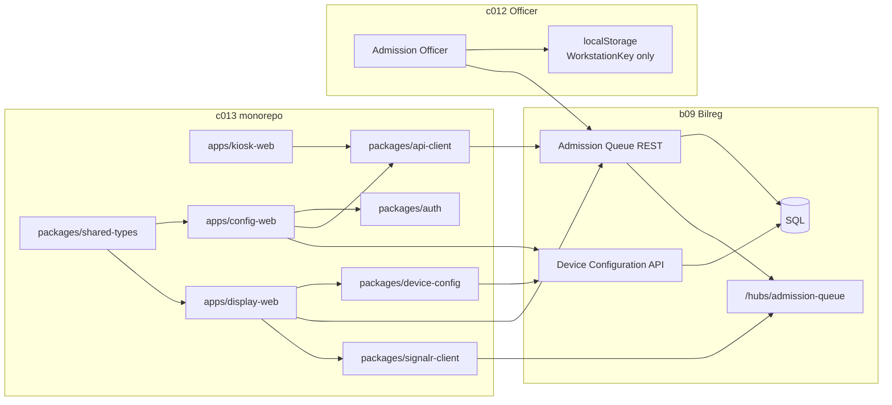
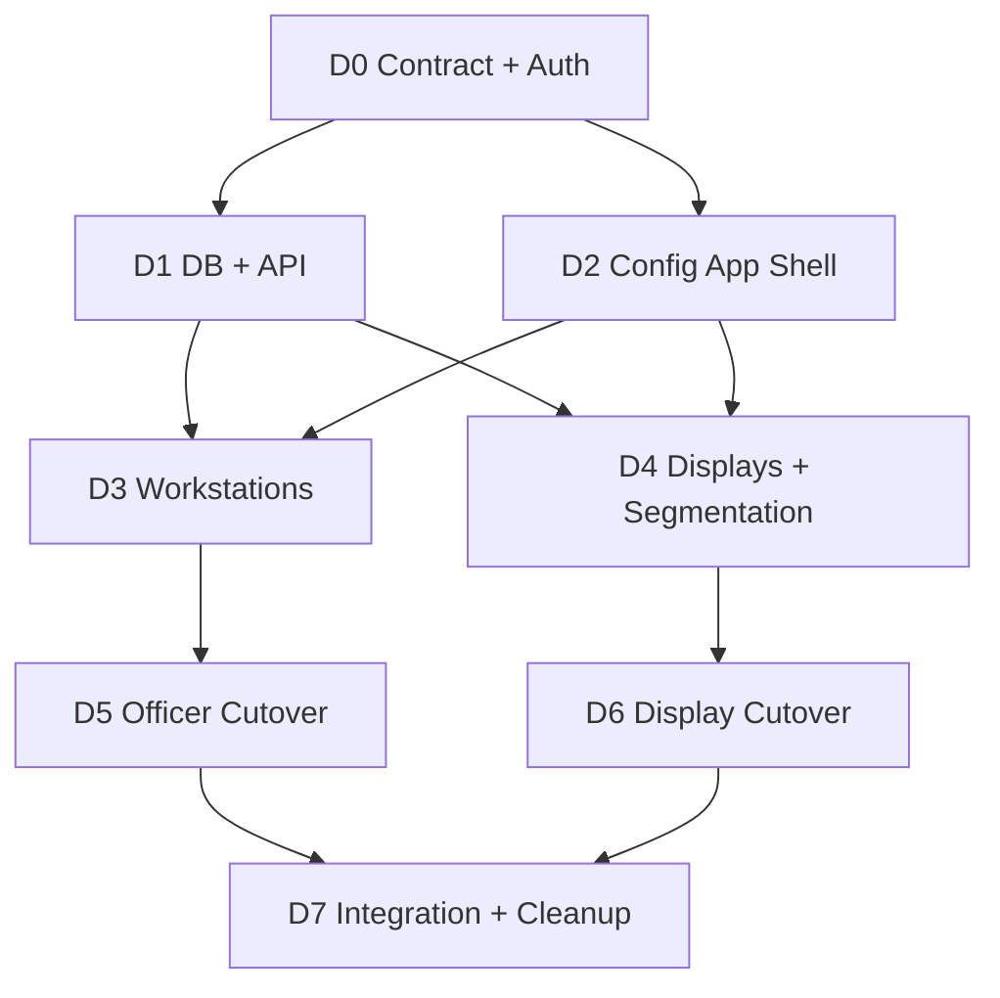

# Admission Queue Device Configuration — Implementation Plan

**Status:** Approved architecture, implementation pending  
**Date:** 24 July 2026  
**Canonical owner:** `c013-kiosk-queue-display-web`  
**Scope:** Workstation identity, Loket mapping, Queue Display configuration, display segmentation,
Officer device binding, and deployment  
**Repositories:**

- `c013-kiosk-queue-display-web` — new third application and shared client packages
- `b09-bilreg-api` — configuration authority, persistence, authorization, audit, and runtime APIs
- `c012_myhospital_web` — Admission Officer workstation selection and queue mutation migration

---

## 1. Approved Decisions

The following decisions are authoritative for this plan:

1. A new third application is added to the existing `c013-kiosk-queue-display-web` monorepo.
2. The application directory is `apps/config-web`.
3. The public deployment path is `/queue-config/`.
4. The application name shown to users is **Konfigurasi Perangkat Antrian Admisi**.
5. There is no tiered authorization by unit, location, or supervisor.
6. There is no maker-checker or approval workflow.
7. Every configuration change is performed directly by a user who has the single required
   configuration permission.
8. Users without that permission cannot open the configuration application or call its management
   endpoints.
9. Admission Officer stores only `WorkstationKey` in localStorage.
10. Bilreg API resolves `WorkstationKey → LoketKey`; the browser is not authoritative for
    `LoketKey`.
11. Queue Display uses `/display/{screenId}` as its primary identity.
12. Display localStorage is optional convenience only and is not configuration authority.
13. Display segmentation uses a many-to-many `DisplayId ↔ LoketKey` mapping.
14. One Loket may be displayed on multiple Queue Displays.
15. One Queue Display may display only its configured subset of Lokets.
16. Officer does not discover or trigger display browsers directly.
17. Bilreg commits the Call, publishes a SignalR refresh hint, and each relevant display reloads the
    authoritative snapshot.
18. SignalR remains hint-only; persisted snapshot and `AnnouncementVersion` remain authoritative.

### 1.1 Explicitly rejected designs

- Storing authoritative `LoketKey` or display-to-Loket mapping in browser localStorage.
- Tiered authorization by unit or location.
- Supervisor approval, maker-checker, pending approval, or scheduled approval states.
- A configuration form embedded in the Admission registration form.
- Officer-side fan-out to individual Queue Displays.
- JWT, password, or permanent device secret inside a QR code.
- Using the current build-time `VITE_BILREG_TOKEN` as the credential for configuration writes.

---

## 2. Target Outcome

After implementation:

1. An authorized configuration user opens `/queue-config/`.
2. The user manages Workstations, Queue Displays, and display segmentation.
3. An Admission Officer selects a Workstation once on the Officer PC.
4. `c012` stores the selected `WorkstationKey` in localStorage.
5. Every queue mutation sends `X-Workstation-Key`.
6. Bilreg resolves the current mapped `LoketKey`.
7. A Queue Display starts from `/display/{screenId}` and loads its current server-managed
   configuration.
8. A Call at one Loket appears on every configured display for that Loket and nowhere else.
9. Configuration changes are effective without rebuilding Officer or Display frontend artifacts.
10. Every configuration write records who changed what and when.

---

## 3. Current State and Main Gaps

| Area | Current state | Required change |
|---|---|---|
| Monorepo apps | `kiosk-web`, `display-web` | Add `config-web` |
| Monorepo auth | Environment token provider | Add interactive user-session provider for config app |
| Workstation config | `c012` `global_config.json` contains `workstationKey` and `loketKey` | Select Workstation in UI; localStorage contains only `WorkstationKey` |
| Queue mutations | Client sends workstation and Loket in header/body | Client sends workstation; server resolves Loket |
| Server mapping | `AdmissionQueueApi:Workstations` application configuration | Server-managed persistent master data |
| Display config | Static `devices.json` loaded by display app | Server-backed device configuration provider |
| Display identity | `/display/{screenId}` | Retain |
| Display segmentation | `screenId → loketIds` in static JSON | Persistent many-to-many mapping |
| SignalR routing | Broadcast `RefreshHint`, client filter | Retain for first release |
| Configuration UI | None | New standalone app |
| Audit | Queue operation audit only/current backend behavior | Add configuration change audit |

### 3.1 Existing behavior to preserve

- `GET /api/v1/admission-queue/displays/current` remains display recovery truth.
- Display refetches on relevant `RefreshHint`.
- Display continues periodic polling if SignalR is unavailable.
- Audio plays only when a reloaded snapshot has a higher `AnnouncementVersion`.
- Cold display startup seeds versions without replaying an old announcement.
- Queue Call/Recall concurrency and row-version behavior remain unchanged.
- Queue Label allocation remains server-side.

---

## 4. Target Architecture



### 4.1 Application boundaries

`config-web` owns:

- management UI;
- validation feedback and impact preview;
- Workstation CRUD;
- Queue Display CRUD;
- display segmentation editing;
- read-only audit history;
- canonical display URL and QR URL generation.

`config-web` does not own:

- queue state;
- Call/Recall/Start Service;
- Queue Label allocation;
- direct display notification;
- user or role administration;
- approval workflow;
- device secrets in browser storage.

---

## 5. Monorepo Placement

### 5.1 Target structure

```text
c013-kiosk-queue-display-web/
├── apps/
│   ├── kiosk-web/
│   ├── display-web/
│   └── config-web/
├── packages/
│   ├── api-client/
│   ├── auth/
│   ├── device-config/
│   ├── shared-types/
│   └── signalr-client/
├── docs/
├── package.json
├── pnpm-workspace.yaml
└── turbo.json
```

### 5.2 Root scripts

Add:

```json
{
  "scripts": {
    "dev:config": "pnpm --filter config-web dev"
  }
}
```

The existing root `build`, `test`, `lint`, and `typecheck` Turbo tasks must include `config-web`
automatically through the workspace.

### 5.3 `config-web` baseline

Recommended stack:

- Vue 3
- TypeScript
- Vite
- Vue Router
- TanStack Query
- Zod
- Vitest
- existing `@aq/*` workspace packages

Recommended internal layout:

```text
apps/config-web/
├── public/
│   ├── web.config
│   └── version.json
├── src/
│   ├── components/
│   │   ├── overview/
│   │   ├── workstation/
│   │   ├── display/
│   │   ├── segmentation/
│   │   └── audit/
│   ├── composables/
│   ├── infrastructure/
│   ├── lib/
│   ├── router/
│   ├── views/
│   ├── App.vue
│   └── main.ts
├── index.html
├── package.json
├── tsconfig.app.json
├── tsconfig.json
└── vite.config.ts
```

### 5.4 Public route

Use:

```text
/queue-config/
```

Suggested application routes:

```text
/queue-config/
/queue-config/workstations
/queue-config/displays
/queue-config/segmentation
/queue-config/audit
```

Use SPA fallback in `web.config`. The route must not overlap `/kiosk/*` or `/display/*`.

---

## 6. Authorization and Authentication

### 6.1 Single permission model

Define one server-side policy:

```text
AdmissionQueueConfiguration
```

It grants all management functions:

- list configuration;
- create and update Workstations;
- activate/deactivate Workstations;
- create and update Queue Displays;
- activate/deactivate Queue Displays;
- update display segmentation;
- read configuration audit history.

There are no sub-permissions, unit scopes, supervisor levels, or approval roles.

### 6.2 Enforcement

The policy must be enforced by Bilreg API on every configuration management endpoint. UI route guards
are convenience only and are not a security boundary.

Expected behavior:

| Condition | Result |
|---|---|
| Not authenticated | HTTP 401 |
| Authenticated without permission | HTTP 403 |
| Authenticated with permission | Management operation allowed |

### 6.3 Config app session

`config-web` must use an interactive Bilreg user session or approved SSO integration. It must not use
the environment JWT mechanism currently sufficient for non-interactive kiosk/display boot.

Implementation requirements:

- extend `packages/auth` with a session-based `IAuthTokenProvider` implementation;
- preserve `EnvAuthTokenProvider` for kiosk/display compatibility;
- do not persist long-lived access tokens in localStorage;
- reuse the platform refresh/session mechanism where available;
- clear application state on logout or 401;
- redirect unauthenticated users to the approved login flow;
- show a dedicated forbidden page on 403.

Authentication integration is a blocking foundation task. CRUD UI must not be released with a
shared static configuration token.

---

## 7. Server Data Model

Names below are conceptual. Final table naming must follow `b09` database standards and migration
conventions.

### 7.1 Workstation

| Field | Type/behavior |
|---|---|
| `WorkstationKey` | string, immutable identifier, unique |
| `DisplayName` | required user-facing name |
| `LocationName` | optional operational label |
| `LoketKey` | required active mapping |
| `Active` | boolean |
| `Notes` | optional |
| `CreatedAt`, `CreatedBy` | audit metadata |
| `UpdatedAt`, `UpdatedBy` | audit metadata |
| `RowVersion` | optimistic concurrency |

Initial cardinality:

```text
one Workstation → one Loket
one Loket → at most one active Workstation
```

The existing duplicate-Loket rejection is preserved for the first release.

### 7.2 Queue Display

| Field | Type/behavior |
|---|---|
| `DisplayId` | string, immutable identifier, unique |
| `DisplayName` | required user-facing name |
| `LocationName` | optional operational label |
| `Active` | boolean |
| `AudioEnabled` | boolean |
| `PollIntervalMs` | bounded positive integer |
| `LayoutKey` | optional supported layout identifier |
| `Notes` | optional |
| `CreatedAt`, `CreatedBy` | audit metadata |
| `UpdatedAt`, `UpdatedBy` | audit metadata |
| `RowVersion` | optimistic concurrency |

### 7.3 DisplayLoket

| Field | Type/behavior |
|---|---|
| `DisplayId` | foreign key to Queue Display |
| `LoketKey` | configured Loket identifier |
| `SortOrder` | optional display ordering |

Constraints:

- unique `(DisplayId, LoketKey)`;
- deleting a mapping never deletes queue history;
- inactive display configuration remains readable to management but is rejected by runtime boot;
- one Loket may occur in many Display rows;
- one Display may have many Lokets.

### 7.4 ConfigurationAudit

Record:

- audit ID;
- timestamp;
- authenticated user ID;
- entity type;
- entity key;
- action: create, update, activate, deactivate, mapping replacement;
- before snapshot;
- after snapshot;
- request/correlation ID.

There is no approval state. A successful authorized write is immediately active after commit.

### 7.5 Delete policy

Do not hard-delete Workstations or Displays that have been used. Use Active/Inactive state.

Immutable identifiers:

- `WorkstationKey`;
- `DisplayId`.

If an identifier was entered incorrectly, deactivate the record and create a new one.

---

## 8. API Contract

All routes below are proposed under:

```text
/api/v1/admission-queue/configuration
```

### 8.1 Management endpoints

| Method | Route | Purpose |
|---|---|---|
| GET | `/summary` | Dashboard counts and validation warnings |
| GET | `/workstations` | List/search Workstations |
| POST | `/workstations` | Create Workstation |
| GET | `/workstations/{workstationKey}` | Workstation detail |
| PUT | `/workstations/{workstationKey}` | Update Workstation using row version |
| POST | `/workstations/{workstationKey}/activate` | Activate |
| POST | `/workstations/{workstationKey}/deactivate` | Deactivate |
| GET | `/displays` | List/search Queue Displays |
| POST | `/displays` | Create Queue Display |
| GET | `/displays/{displayId}` | Display detail and Loket mappings |
| PUT | `/displays/{displayId}` | Update Display using row version |
| PUT | `/displays/{displayId}/lokets` | Atomically replace Loket mapping |
| POST | `/displays/{displayId}/activate` | Activate |
| POST | `/displays/{displayId}/deactivate` | Deactivate |
| GET | `/segmentation` | Cross-display coverage projection |
| GET | `/audit` | Paginated audit history |

Every endpoint in this section requires `AdmissionQueueConfiguration`.

### 8.2 Runtime endpoints

Runtime consumers must not depend on management DTOs.

| Method | Route | Consumer | Purpose |
|---|---|---|---|
| GET | `/api/v1/admission-queue/workstations/available` | Officer | List selectable active Workstations |
| GET | `/api/v1/admission-queue/workstations/{key}/context` | Officer | Resolve current Workstation context |
| GET | `/api/v1/admission-queue/devices/displays/{displayId}` | Display | Resolve active display boot config |

Example Workstation context:

```json
{
  "workstationKey": "WS-ADM-001",
  "displayName": "PC Admisi 1",
  "locationName": "Lobby Utama",
  "loketKey": "LOKET-01",
  "loketDisplayName": "Loket 1",
  "active": true
}
```

Example Display boot config:

```json
{
  "deviceId": "DISPLAY-LOBBY-A",
  "role": "display",
  "displayName": "Display Lobby A",
  "locationName": "Lobby Utama",
  "loketIds": ["LOKET-01", "LOKET-02", "LOKET-03"],
  "pollIntervalMs": 15000,
  "audioEnabled": true,
  "layoutKey": "default"
}
```

Runtime authorization must follow existing Officer/Display authentication boundaries. It does not
grant configuration write access.

### 8.3 Queue mutation target contract

Target Call request:

```http
POST /api/v1/admission-queue/entries/{antrianId}/{noUrut}/call
Authorization: Bearer <user-token>
X-Workstation-Key: WS-ADM-001
```

```json
{
  "userId": "<pegawai-id>"
}
```

The API:

1. reads `X-Workstation-Key`;
2. resolves an active Workstation;
3. resolves `LoketKey`;
4. validates the user and queue transition;
5. performs the existing transactional Call;
6. publishes `RefreshHint { loketKey }` after commit;
7. returns the resolved context in the response.

Apply the same resolution rule to every mutation that currently requires browser-provided
`LoketKey`.

### 8.4 Error contract

Add stable error codes:

| HTTP | Code | Meaning |
|---|---|---|
| 400 | `AQ_CONFIG_INVALID` | Invalid management payload |
| 404 | `AQ_WORKSTATION_NOT_FOUND` | Unknown Workstation |
| 409 | `AQ_WORKSTATION_INACTIVE` | Workstation cannot be used |
| 409 | `AQ_WORKSTATION_LOKET_CONFLICT` | Active Loket already mapped |
| 404 | `AQ_DISPLAY_NOT_FOUND` | Unknown Display |
| 409 | `AQ_DISPLAY_INACTIVE` | Display cannot boot |
| 409 | `AQ_DISPLAY_MAPPING_REQUIRED` | Active Display has no Lokets |
| 409 | `AQ_CONFIG_CONCURRENCY` | Row version changed |
| 403 | `AQ_CONFIG_FORBIDDEN` | User lacks configuration permission |

Use existing JSend/error conventions.

### 8.5 Compatibility window

During migration, the API may continue accepting:

- `X-Loket-Key`;
- `loketKey` in mutation bodies.

Compatibility rules:

1. server-resolved `LoketKey` remains authoritative;
2. if the legacy client value is present and mismatched, return a clear compatibility error;
3. log legacy-contract usage;
4. remove the legacy fields after `c012` production cutover and an agreed release window.

---

## 9. Configuration Application UI

### 9.1 Navigation

Primary navigation:

```text
[Ringkasan] [Workstation] [Queue Display] [Segmentasi] [Riwayat]
```

All tabs are available to the same authorized configuration user. There is no per-tab authorization.

### 9.2 Ringkasan

Show:

- active/inactive Workstation count;
- active/inactive Queue Display count;
- active Lokets without a Display;
- Displays without a Loket mapping;
- invalid/inactive references;
- recent configuration changes.

Warnings are operational validation, not approval requests.

### 9.3 Workstation

List columns:

- name;
- `WorkstationKey`;
- location;
- mapped Loket;
- status;
- last updated;
- actions.

Actions:

- create;
- view/edit;
- activate/deactivate.

Form:

- immutable `WorkstationKey`;
- display name;
- location;
- Loket;
- active state on create;
- notes;
- row version on edit.

Validation:

- unique Workstation key;
- unique active Loket mapping;
- known Loket;
- no blank required values;
- impact confirmation when changing Loket.

### 9.4 Queue Display

List columns:

- display name;
- `DisplayId`;
- location;
- mapped Loket count;
- audio state;
- polling interval;
- status;
- last updated;
- actions.

Actions:

- create;
- view/edit;
- activate/deactivate;
- copy canonical URL;
- preview display;
- show QR URL.

Form:

- immutable `DisplayId`;
- display name;
- location;
- active state;
- audio enabled;
- poll interval;
- supported layout;
- notes;
- multi-select Lokets.

### 9.5 Segmentasi

Primary editor:

- select one Display;
- show its assigned Lokets;
- add/remove/reorder Lokets;
- show impact preview;
- atomically save the complete mapping.

Coverage view:

| Loket | Display Lobby A | Display Lobby B | Display IGD |
|---|:---:|:---:|:---:|
| LOKET-01 | ✓ | ✓ | |
| LOKET-02 | ✓ | | |
| LOKET-10 | | | ✓ |

Required behavior:

- one Loket may be checked for multiple Displays;
- unchecked Lokets do not appear or announce on that Display;
- warn if an active Loket loses its last Display;
- warn if an active Display has no Lokets;
- warnings can block invalid active state but do not create an approval request.

### 9.6 Riwayat

Read-only list:

- timestamp;
- user;
- entity;
- action;
- before/after values;
- correlation ID.

No approve/reject actions exist.

### 9.7 URL and QR actions

Canonical display URL:

```text
{publicOrigin}/display/{DisplayId}
```

Buttons:

- **Salin URL** — copies canonical URL;
- **Preview Display** — opens the display in a new tab with local audio suppressed;
- **Tampilkan QR URL** — renders a QR containing only the canonical URL.

The QR must never contain a JWT, password, configuration permission, or permanent device secret.

Recommended preview URL:

```text
/display/{DisplayId}?preview=1
```

`preview=1` suppresses local audio and shows a preview banner. It must not modify persisted
configuration.

---

## 10. Officer Workstation UI (`c012`)

### 10.1 Local storage

Storage key:

```text
myhospital.admissionQueue.workstation
```

Value:

```json
{
  "workstationKey": "WS-ADM-001",
  "configuredAt": "2026-07-24T10:00:00+07:00",
  "schemaVersion": 1
}
```

Do not store:

- authoritative `LoketKey`;
- user JWT specifically for this feature;
- display mapping;
- queue state.

### 10.2 Setup flow

When no valid Workstation is stored:

1. disable queue mutation actions;
2. load available active Workstations;
3. show a dedicated setup dialog/page;
4. user selects a Workstation;
5. frontend resolves its server context;
6. frontend stores `WorkstationKey`;
7. UI shows resolved Workstation and Loket;
8. queue mutations become available.

Provide **Ganti Workstation**. It replaces local selection after explicit confirmation.

### 10.3 Runtime behavior

- resolve context on application boot;
- resolve/refetch after server invalidation or configuration error;
- server resolves again for every mutation;
- if unknown/inactive, remove local selection and require setup again;
- on 403, show access error without silently switching Workstations;
- on queue concurrency conflict, retain existing worklist/snapshot recovery behavior.

### 10.4 Config migration

Remove the per-PC requirement for:

```json
{
  "workstationKey": "...",
  "loketKey": "..."
}
```

Keep feature flags and polling configuration in runtime config. During compatibility release, old
values may be read only as a migration seed, then written to localStorage after successful server
resolve. Do not continue treating them as authority.

---

## 11. Display Runtime Migration (`c013`)

### 11.1 Server-backed device provider

Add a provider implementation in `packages/device-config`:

```text
ApiDeviceConfigurationProvider
```

It implements the existing `IDeviceConfigurationProvider`, allowing `display-web` to switch from
`devices.json` without coupling the app directly to management DTOs.

### 11.2 Provider selection

During rollout:

- production uses API provider;
- JSON provider remains available for tests and emergency compatibility;
- provider selection is explicit configuration, not silent fallback;
- an API error must not silently load stale static mapping.

After production stabilization, remove `devices.json` as operational authority.

### 11.3 Boot behavior

1. parse `screenId` from `/display/{screenId}`;
2. request runtime display configuration;
3. reject unknown/inactive Display;
4. validate non-empty Loket mapping for active Display;
5. load current snapshot;
6. filter by configured Lokets;
7. connect SignalR;
8. poll snapshot at configured interval.

### 11.4 Segmentation behavior

For `RefreshHint { loketKey }`:

```text
if loketKey is null:
    refetch
else if loketKey is in configured loketIds:
    refetch
else:
    ignore
```

After refetch, filter the snapshot again by the current configured Loket set before rendering or
announcing.

For the first release, retain `Clients.All`. SignalR groups are unnecessary unless measured scale
shows broadcast overhead.

### 11.5 Configuration refresh

A running Display must eventually receive mapping changes without manual browser restart.

Recommended implementation:

- refetch display configuration periodically, e.g. every 60 seconds;
- refetch immediately after reconnect;
- if Loket mapping changes, update query keys and reload snapshot;
- seed `AnnouncementVersion` for newly added Lokets to avoid replaying existing calls;
- remove cards for removed Lokets without announcing;
- if Display becomes inactive, stop SignalR/audio and show a configuration-disabled page.

Do not reuse queue `AnnouncementVersion` as configuration version. Add a configuration row version or
`updatedAt` to the runtime config if conditional refresh is needed.

### 11.6 Preview mode

When `preview=1`:

- configuration and snapshot load normally;
- SignalR may connect normally;
- audio is always disabled locally;
- show **Mode Preview** banner;
- no server configuration is modified.

---

## 12. Backend Workstation Resolution Migration

### 12.1 Central resolver

Create one resolver service used by every Loket-scoped queue mutation:

```text
IAdmissionQueueWorkstationResolver
```

Result:

```text
WorkstationContext
  WorkstationKey
  WorkstationDisplayName
  LoketKey
  Active
```

Do not duplicate header parsing and mapping lookup in individual controller actions.

### 12.2 Transaction behavior

Configuration lookup occurs before the operational transaction. The resolved `LoketKey` is passed to
the existing domain command/repository flow.

For an operation:

1. authenticate user;
2. resolve active Workstation;
3. validate queue state;
4. execute transaction;
5. write operation/audit context;
6. commit;
7. publish SignalR hint.

Do not publish a display hint if the transaction fails.

### 12.3 Configuration concurrency

Management writes use row version. If another authorized user changed the same record:

- return `AQ_CONFIG_CONCURRENCY`;
- UI reloads current values;
- user reviews and resubmits manually.

There is no pending approval state.

---

## 13. Implementation Phases

### Phase D0 — Contract and authentication foundation

**Goal:** Finalize contracts and ensure config writes use a real user session.

Tasks:

- define `AdmissionQueueConfiguration` policy;
- confirm the Bilreg login/session integration used by standalone `config-web`;
- extend `packages/auth` with session token provider;
- define management/runtime Zod schemas in `packages/shared-types`;
- define stable API errors;
- document compatibility behavior for legacy Loket fields;
- add contract tests before UI implementation.

Exit criteria:

- authorized session can call a protected proof endpoint;
- unauthorized and forbidden cases return 401/403;
- no config write uses `VITE_BILREG_TOKEN`;
- API DTOs and shared schemas agree.

### Phase D1 — Database and configuration API

**Goal:** Establish server authority.

Tasks:

- add Workstation, Queue Display, DisplayLoket, and audit persistence;
- add constraints and row versions;
- add management queries/commands;
- add runtime Workstation context endpoints;
- add runtime Display boot endpoint;
- add summary and segmentation projections;
- add configuration audit;
- seed/migrate current `AdmissionQueueApi:Workstations`;
- seed/migrate existing `devices.json` display rows;
- verify migration rollback/forward behavior.

Exit criteria:

- management API CRUD passes integration tests;
- runtime endpoints return active configuration;
- many-to-many display segmentation works;
- duplicate active Workstation/Loket mappings are rejected;
- writes record authenticated user audit.

### Phase D2 — `config-web` application foundation

**Goal:** Add the third application and protected shell.

Tasks:

- scaffold `apps/config-web`;
- add `/queue-config/` Vite base and router;
- add interactive authentication boot;
- add route guard and forbidden page;
- add TanStack Query client and typed infrastructure;
- extend root `dev:config` script;
- add `web.config` and `version.json`;
- add base navigation and error boundaries.

Exit criteria:

- app builds through root Turbo build;
- authorized user enters application;
- unauthorized user cannot access protected content;
- deep links work through IIS SPA fallback.

### Phase D3 — Workstation management

**Goal:** Manage Workstation master and Loket mapping.

Tasks:

- Workstation list, filters, empty/loading/error states;
- create form;
- edit form;
- activate/deactivate;
- immutable key behavior;
- row-version conflict recovery;
- Loket uniqueness validation;
- change-impact confirmation;
- audit entries.

Exit criteria:

- authorized user can manage Workstations end-to-end;
- invalid or conflicting mappings cannot be saved;
- no approval state is created;
- successful change is immediately visible from runtime context endpoint.

### Phase D4 — Queue Display and segmentation management

**Goal:** Manage Displays and many-to-many Loket coverage.

Tasks:

- Display list and form;
- activate/deactivate;
- Loket multi-select;
- segmentation editor;
- coverage matrix;
- impact warnings;
- atomic mapping replacement;
- URL copy;
- preview mode link;
- QR URL dialog;
- audit history UI.

Exit criteria:

- one Loket can map to two or more Displays;
- one Display renders only assigned Lokets;
- active Display cannot be saved with invalid configuration;
- QR contains canonical URL only;
- audit shows before/after mapping.

### Phase D5 — Officer workstation selection and server resolution

**Goal:** Remove browser authority over Loket.

Tasks in `b09`:

- implement central Workstation resolver;
- update Call/Recall/Start and all Loket-scoped mutations;
- retain temporary compatibility validation;
- add telemetry for legacy fields.

Tasks in `c012`:

- add Workstation storage adapter;
- add selection/setup UI;
- add resolved context query;
- show active Workstation/Loket indicator;
- add Ganti Workstation;
- send only `X-Workstation-Key` in target mode;
- remove `loketKey` from mutation bodies;
- update action rules and tests;
- update Officer SOP.

Exit criteria:

- new PC can be configured without editing `global_config.json`;
- manipulated client Loket cannot redirect a Call;
- unknown/inactive Workstation blocks mutation;
- existing queue concurrency recovery remains intact.

### Phase D6 — Display server configuration cutover

**Goal:** Replace static display mapping authority.

Tasks:

- implement `ApiDeviceConfigurationProvider`;
- use runtime Display endpoint;
- add periodic configuration refresh;
- add inactive/unknown configuration pages;
- implement preview audio suppression;
- migrate production Display definitions;
- make provider selection explicit;
- retain JSON only for controlled compatibility/testing.

Exit criteria:

- changing display segmentation in config app updates running Display;
- a Loket mapped to two Displays appears on both;
- unrelated Display ignores the call;
- removed Loket disappears without audio replay;
- SignalR outage remains recoverable through polling.

### Phase D7 — Integration, deployment, and contract cleanup

**Goal:** Production-ready cutover.

Tasks:

- cross-repo end-to-end tests;
- authorization penetration checks for management endpoints;
- IIS deployment packaging for `queue-config`;
- database backup and migration checklist;
- seed reconciliation report;
- smoke test scripts/checklist;
- observability and correlation IDs;
- update runbook;
- deploy compatibility release;
- measure legacy header/body usage;
- remove legacy Loket authority after zero usage;
- retire static production `devices.json`.

Exit criteria:

- all acceptance tests pass in staging;
- rollback is documented and rehearsed;
- no configuration endpoint is callable without permission;
- all three c013 apps deploy together or independently as documented;
- legacy contract is removed only after verified cutover.

---

## 14. Dependency Order



Parallelizable work after D0:

- backend persistence/API;
- config app shell;
- shared client schemas;
- test fixture design.

Officer and Display production cutovers must wait for their server runtime endpoints.

---

## 15. Testing Strategy

### 15.1 Backend unit tests

- Workstation key and Display ID validation;
- active/inactive behavior;
- one active Workstation per Loket;
- many-to-many DisplayLoket mapping;
- mapping replacement;
- row-version conflict;
- summary warnings;
- audit before/after serialization;
- Workstation resolver.

### 15.2 Backend integration/contract tests

- 401/403/authorized management access;
- CRUD and deactivate flows;
- runtime DTO compatibility with Zod schemas;
- Call resolves server Loket;
- legacy Loket mismatch behavior;
- SignalR publish after successful commit only;
- database uniqueness and foreign keys.

### 15.3 `config-web` tests

- protected route boot;
- Workstation create/edit/deactivate;
- Display create/edit/deactivate;
- Loket multi-select;
- segmentation matrix projection;
- impact warnings;
- concurrency recovery;
- URL copy;
- QR payload contains URL only;
- preview URL;
- audit rendering.

### 15.4 Officer tests

- empty storage opens setup;
- valid selection persists;
- boot resolve restores UI context;
- inactive/unknown context clears selection;
- Ganti Workstation replaces selection;
- mutation sends Workstation only;
- no client-provided Loket authority;
- 403/409 recovery behavior.

### 15.5 Display tests

- API device provider parses configuration;
- relevant hint refetches;
- irrelevant hint is ignored;
- snapshot is filtered after refetch;
- one Loket appears on two Displays;
- newly added Loket seeds audio version;
- removed Loket does not announce;
- inactive Display stops operation;
- preview mode never plays audio;
- polling works without SignalR.

### 15.6 End-to-end scenarios

1. Configure Workstation A → Loket 01.
2. Configure Display A → Loket 01, 02.
3. Configure Display B → Loket 01, 04.
4. Bind Officer PC to Workstation A.
5. Call queue number from Workstation A.
6. Verify Displays A and B show/announce the call.
7. Verify unrelated Display does not show/announce it.
8. Remove Loket 01 from Display B.
9. Verify the next Call appears only on Display A.
10. Disable Display A and verify its runtime disabled state.
11. Attempt all management writes without permission and verify 403.
12. Disconnect SignalR and verify polling recovery.

---

## 16. Deployment Plan

### 16.1 IIS layout

```text
wwwroot/
├── kiosk/
├── display/
└── queue-config/
```

Routes:

```text
/kiosk/{stationId}
/display/{screenId}
/queue-config/*
```

### 16.2 Environment settings

`config-web` requires:

- Bilreg API base URL;
- approved user-session/login configuration;
- public origin/base path.

Do not configure a shared write-capable JWT in build output.

### 16.3 Rollout order

1. Deploy database migration and backward-compatible API.
2. Seed current Workstation and Display configuration.
3. Verify management data against existing appsettings/devices JSON.
4. Deploy `config-web`.
5. Validate configuration with authorized users.
6. Deploy `c012` compatibility Officer release.
7. Migrate Officer PCs to UI-selected Workstations.
8. Deploy API-backed Display provider.
9. Verify display segmentation and runtime refresh.
10. Observe legacy contract telemetry.
11. Remove legacy fields and static production authority in a later release.

### 16.4 Rollback

Before cutover:

- back up configuration tables;
- archive current appsettings Workstation mappings;
- archive current `devices.json`;
- archive prior `c012` and `c013` build artifacts.

Compatibility release rollback:

- restore previous frontend builds;
- keep backward-compatible API accepting old fields;
- switch Display provider explicitly back to JSON only if the rollback runbook authorizes it;
- do not roll back queue operational data.

Database rollback must not remove configuration records already referenced by audit or operations.
Prefer forward-fix after production writes begin.

---

## 17. Observability and Operations

Log:

- authenticated configuration user;
- entity and key;
- before/after action summary;
- correlation ID;
- validation failure;
- concurrency conflict;
- Workstation resolve failure;
- Display boot resolve failure;
- legacy contract use.

Metrics:

- active/inactive Workstation count;
- active/inactive Display count;
- active Lokets without Display coverage;
- runtime Workstation resolve failures;
- runtime Display config failures;
- configuration write failures;
- legacy request count;
- Display SignalR reconnects and snapshot failures where telemetry exists.

Do not log:

- JWTs;
- passwords;
- full patient identity;
- browser localStorage contents beyond non-sensitive device key when operationally necessary.

---

## 18. Documentation Deliverables

Update:

### `c013`

- root README with third app commands;
- monorepo architecture document;
- Queue Display deployment guide;
- IIS cutover checklist;
- Queue Display runbook;
- configuration application user guide;
- configuration recovery guide.

### `b09`

- API contract;
- database/migration manifest;
- authorization policy documentation;
- operational runbook;
- workstation mapping documentation;
- display configuration/segmentation documentation.

### `c012`

- Admission Officer SOP;
- runtime configuration reference;
- workstation setup and change instructions;
- error/recovery guide.

---

## 19. Acceptance Criteria

The overall implementation is complete only when:

1. `apps/config-web` is the third app in the c013 monorepo.
2. It is deployed under `/queue-config/`.
3. Only users with `AdmissionQueueConfiguration` can access management data or writes.
4. There is no tiered unit/location authorization.
5. There is no approval workflow.
6. Workstation and Display identifiers are immutable.
7. Workstation mapping is server-authoritative.
8. Officer localStorage contains only `WorkstationKey` and metadata.
9. Queue mutation Loket is resolved by the server.
10. Queue Display configuration is server-backed.
11. `/display/{screenId}` remains the primary display identity.
12. One Loket can be displayed on two or more Displays.
13. Each Display renders and announces only configured Lokets.
14. SignalR remains hint-only.
15. Snapshot polling recovers from missed SignalR messages.
16. Display mapping changes become effective without rebuilding frontend artifacts.
17. QR contains only the canonical display URL.
18. Configuration writes are immediately active after a successful authorized commit.
19. Every configuration write has an audit entry.
20. Backward compatibility is removed only after measured client cutover.

---

## 20. Deferred Features

The following are not required for the initial release:

- configuration import/export;
- SignalR groups per Loket;
- hardware device certificates;
- one-time QR enrollment codes;
- device heartbeat and last-seen dashboard;
- remote audio test command;
- alternative display layouts beyond the initial supported set;
- multiple active Workstations for one Loket;
- Android TV-specific client;
- configuration approval or scheduling.

Deferred features must not block the server-authoritative Workstation and Display configuration
foundation.

---

## 21. Recommended Delivery Slices

For manageable pull requests:

1. **PR 1 — Contracts and authentication provider**
2. **PR 2 — Database migration and configuration repositories**
3. **PR 3 — Management/runtime API endpoints**
4. **PR 4 — `config-web` shell and protected routing**
5. **PR 5 — Workstation management UI**
6. **PR 6 — Display and segmentation UI**
7. **PR 7 — Officer local Workstation setup**
8. **PR 8 — Server-resolved queue mutations**
9. **PR 9 — API-backed Display configuration**
10. **PR 10 — Integration, IIS packaging, runbook, and compatibility cleanup**

Each PR must include proportional automated tests and documentation updates. Database/API
compatibility must be deployed before dependent client changes.
