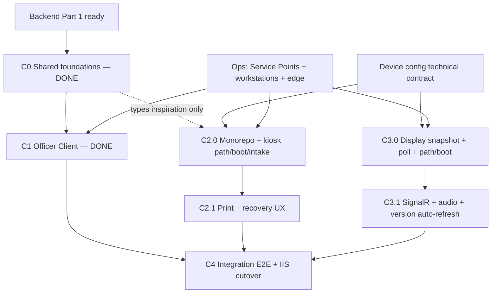

# Patient Tracker — Admission Queue External Clients Implementation Plan

> **Operational mirror** of `b09-bilreg-api/docs/contexts/pasien-tracker/TRACKER-ADMISSION-QUEUE-EXTERNAL-CLIENTS-IMPLEMENTATION-PLAN.md`.  
> Prefer editing the b09 canonical copy, then re-sync here. Backend Part 1 plan stays in b09 only.

**Status:** Authoritative external-client plan (living document).  
**Scope:** Officer Client, Kiosk Client, and Queue Display Client that consume Bilreg Admission Queue v1.  
**Relationship:** Part 2 of Admission Queue delivery. Part 1 (backend) is `b09-bilreg-api/docs/contexts/pasien-tracker/TRACKER-ADMISSION-QUEUE-IMPLEMENTATION-PLAN.md`.  
**Architecture addendum (C2/C3):** [kiosk-queue-display-web.md](./kiosk-queue-display-web.md)  
**Evidence / revision date:** 2026-07-23 (C4 closed)

**Roadmap status**

| Phase | Status |
|-------|--------|
| **C0** Shared client foundations (Officer / `c012`) | ✅ Completed — baseline |
| **C1** Officer Client | ✅ Completed — baseline; do not redesign |
| **C2** Kiosk Client | ✅ Completed — monorepo path boot, intake, print ([report](./tracker-c2-kiosk-implementation-report.md)) |
| **C3** Queue Display Client | ✅ Completed — snapshot-first, SignalR, TTS, version reload ([report](./tracker-c3-queue-display-implementation-report.md)) |
| **C4** Integration & Deployment | ✅ Completed — E2E + IIS + runbook ([report](./tracker-c4-integration-deployment-implementation-report.md)) |

**Primary references**

| Artifact | Role |
|----------|------|
| [TRACKER-ADMISSION-QUEUE-DOMAIN.md](./TRACKER-ADMISSION-QUEUE-DOMAIN.md) | Business capabilities and invariants |
| [TRACKER-DOMAIN.md](./TRACKER-DOMAIN.md) | Parent Patient Tracker domain |
| [../admisi-rajal/admisi-rajal-domain.md](../admisi-rajal/admisi-rajal-domain.md) | Admisi Rajal Work List composition boundary |
| [TRACKER-ADMISSION-QUEUE-SOP.md](./TRACKER-ADMISSION-QUEUE-SOP.md) | Target operational procedure |
| [TRACKER-ADMISSION-QUEUE-API-V1.md](./TRACKER-ADMISSION-QUEUE-API-V1.md) | Versioned REST / SignalR / error contract |
| [TRACKER-ADMISSION-QUEUE-RUNBOOK.md](./TRACKER-ADMISSION-QUEUE-RUNBOOK.md) | Workstation mapping, seed, smoke |
| [kiosk-queue-display-web.md](./kiosk-queue-display-web.md) | Path-based IIS deploy + monorepo strategy for kiosk/display |
| Code under `c012_myhospital_web` (Admisi) and `Bilreg.Api` Admission Queue v1 | Executable Officer baseline and API evidence |

**Out of scope of this plan:** Backend authority redesign, R-02 claims-derived actor, R-05B Kiosk transport idempotency, R-14 automations, HiDok Self-Registration decision ownership, production SignalR scale-out, redesign of completed C0/C1 Officer work.

---

## Migration summary (this revision)

> **Changed sections are marked `[CHANGED]`.** Completed C0/C1 content is marked `[BASELINE — DO NOT REDESIGN]`.

| Change | Why |
|--------|-----|
| Mark C0 and C1 ✅ completed | Officer foundations and Officer Client are implemented in `c012`; they are the baseline |
| Replace dual-repo / `c013`+`c014` placement with **monorepo** `apps/*` + `packages/*` | [kiosk-queue-display-web.md](./kiosk-queue-display-web.md) §2 — shared API/SignalR/types must not diverge |
| Replace per-app URL/query config with **path-based routing** `/kiosk/{stationId}`, `/display/{screenId}` | Same doc §1 — on-prem IIS without SSL; one site; clean kiosk shortcuts |
| Replace “separate IIS apps `/AdmissionKiosk/`” with **single IIS site**, folders `kiosk/` + `display/`, SPA `web.config` rewrite | Same doc §1 |
| Add device-config boot resolution and `version.json` auto-refresh | Same doc §4.1 / §4.6 / §2.5 |
| Keep Officer in `c012`; monorepo covers **only** Kiosk + Display | Officer auth/lifecycle differs; C1 must not move |
| Revise backend contract review for device config vs existing AQ snapshot/hub | Map new frontend needs to existing Bilreg surfaces; flag only technical gaps — no new business capabilities |
| First slice becomes **C2.0** (monorepo scaffold + kiosk path routing), not C1.0 | C1.0 already shipped |

---

## 1. Executive summary `[CHANGED]`

Backend Admission Queue Pragmatic V1 remains client-consumable: v1 REST under `/api/v1/admission-queue`, Admisi-composed `GET /api/v1/admisi-rajal/officer-worklist`, journey APIs on `/api/PasienTracker`, SignalR hub `/hubs/admission-queue` (`RefreshHint { loketKey }`), and workstation header validation.

**Officer Client is done** in `c012_myhospital_web` (Admission Queue worklist, Loket headers, Call / Recall / Start Service, feature-flag legacy sidebar). Do not redesign it.

**Kiosk** and **Queue Display** are done in the monorepo (`apps/kiosk-web`, `apps/display-web`), deployed under one IIS site with path-based station/screen IDs, shared packages for API/SignalR/types/device-config, and snapshot-first display authority.

Part 2 external clients are **closed through C4**: cross-client E2E procedures, IIS packaging/cutover checklist, and runbook client sections are published. Remaining work is deferred technical gaps (device-config API, R-02 device auth, R-05B), not new C-phases.

| Client | Platform | Placement | Status |
|--------|----------|-----------|--------|
| **Officer** | Vue 3 in `c012_myhospital_web` | Admisi `RegistrasiRajal` + `admissionQueue/*` | ✅ Baseline |
| **Kiosk** | Vue 3 Vite (`kiosk-web`) + local print proxy | Monorepo `apps/kiosk-web`; IIS `/kiosk/{stationId}` | ✅ C2 |
| **Queue Display** | Vue 3 Vite (`display-web`) fullscreen | Monorepo `apps/display-web`; IIS `/display/{screenId}` | ✅ C3 |
| **Integration** | Ops docs + runbook | Runbook §§8–11 + IIS cutover checklist | ✅ C4 |

**Preferred next work:** deferred gaps only (device-config API, R-02, R-05B) — track outside this C-phase roadmap.

---

## 2. Codebase investigation findings

### 2.1 Repositories in scope `[CHANGED]`

| Location | Finding |
|----------|---------|
| `MyHospitalWeb/b09-bilreg-api` | Backend + docs; SignalR hub `/hubs/admission-queue` implemented |
| `MyHospitalWeb/c012_myhospital_web` | **Officer baseline (C0/C1)** — do not move into monorepo |
| **New monorepo** (working name `myhospitalweb-frontend` or under `MyHospitalWeb/`) | **C2/C3 home** — `apps/kiosk-web`, `apps/display-web`, `packages/*` per [kiosk-queue-display-web.md](./kiosk-queue-display-web.md) |
| `Project.Aktif/X1/kiosk_wpf` | Legacy WPF — UX/print patterns only |
| `Project.Aktif/X1/antres_display*`, `X1/queue/*` | Legacy VB6 — do not port |
| `Project.Aktif/_Published/A025_DisplayAntrian_SmartTV` | Optional later Android TV track |
| `b09-bilreg-api/src/taksaka.frontend/Taksaka.Web` | SignalR reconnect **pattern** only (`/hubs/operations` unrelated) |

### 2.2 Officer baseline (`c012`) — `[BASELINE — DO NOT REDESIGN]`

Implemented (evidence):

| Asset | Path / note |
|-------|-------------|
| Zod DTOs + worklist/display shapes | `src/modules/Admisi/types/admissionQueue.ts` |
| AQ error helpers (`AQ_*`, 409) | `src/core/api/admissionQueueErrors.ts` |
| Workstation config + Loket mutation headers | `src/core/types/admissionQueueConfig.ts`, `global_config` `admissionQueue` |
| Query keys | `src/core/api/queryConfigs.ts` → `admissionQueue.*` |
| API service | `src/modules/Admisi/queries/AdmissionQueueService.ts` — officer-worklist, service-points, displays/current, call/recall/start-service |
| Action rules + composable | `admissionQueueActionRules.ts`, `useOfficerAdmissionQueue.ts` |
| UI | `OfficerAdmissionQueueSidebar`, `OfficerWorklistItemCard`, `AdmissionQueueActionBar` |
| Feature flag | `admissionQueue.enabled` / `useLegacySidebarFallback` |

Historical “missing API client / workstation headers” findings from the original plan are **closed for Officer**. Kiosk/Display still need their own clients in the monorepo (they must not import the full HIS app).

### 2.3 Backend contracts available to clients

| Surface | Status |
|---------|--------|
| `GET/POST /api/v1/admission-queue/*` | Implemented |
| `GET /api/v1/admisi-rajal/officer-worklist` | Implemented — used by C1 |
| `GET/POST /api/PasienTracker/...` | Implemented |
| SignalR `/hubs/admission-queue` → `RefreshHint { loketKey }` | Implemented |
| `GET .../displays/current` (+ optional `loketKey`) with `AnnouncementVersion` on snapshot | Implemented — **display recovery truth** |
| Loket mutations: `X-Loket-Key` + `X-Workstation-Key` | Implemented (Officer) |
| Device config by station/screen ID | **Not implemented** — technical gap for C2/C3 boot (see §8) |
| ReasonCode catalog | Pass-through non-blank — Ops list still external |
| Role policies Officer/Kiosk/Display | Deferred (R-02) |
| Kiosk `ClientRequestId` | Deferred (R-05B) |

### 2.4 Naming collision to avoid

“Antrian” in HIS still means multiple things. Kiosk/Display UI language must use **Queue Label / Service Point / Loket / Call / AnnouncementVersion** from the domain docs. Monorepo `shared-types` names should align with API-V1 field names (`queueLabel`, `loketKey`, `announcementVersion`), not invent parallel domain vocabulary.

---

## 3. Platform recommendations

### 3.1 Officer Client → Web (Vue 3 in `c012`) — `[BASELINE — DO NOT REDESIGN]`

Completed. Remains in HIS for officer auth, registration form, and Admisi module navigation. Not part of the kiosk/display monorepo.

### 3.2 Kiosk Client → Web + local print proxy + path-based IIS — `[CHANGED]`

**Decision (unchanged platform, changed deploy/repo):** Vue 3 Vite kiosk app + local print proxy (`localhost:5050` / `5800`). No WPF port for V1.

**New architecture decisions (authoritative for C2):**

| Area | Decision |
|------|----------|
| Routing | `/kiosk/{stationId}` — station ID from `pathname`, not query string |
| Deploy | Single IIS site; physical folder `wwwroot/kiosk/`; SPA fallback `web.config` |
| Identity | `stationId` → device config at boot; offerings from config ∩ active Service Points |
| Repo | Monorepo `apps/kiosk-web` + shared packages |
| Versioning | App `version.json` for idle auto-refresh; Changesets for shared packages |
| Print | Unchanged local proxy — out of backend scope |

**Reject:** Client-side queue allocation; subdomain-per-device; polyrepo split of kiosk vs display; SQL-direct legacy `kiosk_wpf` as product.

### 3.3 Queue Display Client → Web fullscreen + path-based IIS — `[CHANGED]`

**Decision:** Vue 3 Vite fullscreen display. Android TV deferred.

**Authority rule (non-negotiable):** Persisted snapshot GET is recovery truth. SignalR `RefreshHint` only triggers reload. Audio plays only when reloaded snapshot `AnnouncementVersion` increases.

**New architecture decisions (authoritative for C3):**

| Area | Decision |
|------|----------|
| Routing | `/display/{screenId}` |
| Deploy | Same IIS site; folder `wwwroot/display/`; SPA `web.config` |
| Boot | `screenId` → device config (`loketIds`, display options) |
| Live updates | SignalR reconnect + backoff in `packages/signalr-client`; always snapshot-first on reconnect |
| Poll | Periodic snapshot even when SignalR healthy |
| Auto-refresh | Poll app `version.json`; soft reload when idle if version changed |
| Repo | Monorepo `apps/display-web` |

---

## 4. Architecture and repository / project placement `[CHANGED]`

```mermaid
flowchart LR
  subgraph his [HIS — completed]
    OFF[Officer Web<br/>c012 Admisi]
  end

  subgraph mono [Monorepo — C2/C3]
    KIO[apps/kiosk-web]
    DSP[apps/display-web]
    PKG[packages:<br/>api-client / signalr-client<br/>shared-types / device-config<br/>ui-kit?]
  end

  PROXY[Local print proxy]
  IIS[IIS single site<br/>/kiosk/{stationId}<br/>/display/{screenId}]

  subgraph bilreg [b09-bilreg-api]
    AQ["/api/v1/admission-queue"]
    OW["/api/v1/admisi-rajal/officer-worklist"]
    PT["/api/PasienTracker"]
    HUB["/hubs/admission-queue"]
    DEV["device config<br/>technical contract — see §8"]
  end

  OFF --> AQ
  OFF --> OW
  OFF --> PT
  KIO --> PKG
  DSP --> PKG
  KIO --> AQ
  KIO --> DEV
  KIO --> PROXY
  DSP --> AQ
  DSP --> DEV
  DSP --> HUB
  IIS --> KIO
  IIS --> DSP
```

### 4.1 Placement decisions `[CHANGED]`

| Client | Repository | Project / path |
|--------|------------|----------------|
| Officer | `c012_myhospital_web` (**baseline**) | Existing `Admisi` admission-queue modules — **frozen architecture** |
| Kiosk + Display | **Monorepo** (name TBD; structure fixed) | See §4.1.1 |
| Shared (kiosk/display only) | Same monorepo `packages/*` | Do **not** couple to full HIS `c012` |

#### 4.1.1 Monorepo structure (authoritative)

```text
myhospitalweb-frontend/          # name TBD; may live under MyHospitalWeb/
├── apps/
│   ├── kiosk-web/
│   │   ├── src/
│   │   ├── web.config
│   │   └── vite.config.ts
│   └── display-web/
│       ├── src/
│       ├── web.config
│       └── vite.config.ts
├── packages/
│   ├── api-client/        # JWT REST fetch + AQ route helpers
│   ├── signalr-client/    # reconnect, backoff, RefreshHint → snapshot reload
│   ├── shared-types/      # API-V1-aligned DTOs (Queue Label, Loket, AnnouncementVersion, DeviceConfig)
│   ├── device-config/     # parse station/screen ID from path + fetch device config
│   └── ui-kit/            # optional — only genuinely shared Vue UI
├── package.json
├── pnpm-workspace.yaml
└── turbo.json             # optional build cache
```

Tooling: **pnpm workspaces** + **Turborepo** (optional) + **Changesets** for `packages/*`. App git tags: `kiosk-web@x.y.z`, `display-web@x.y.z`. CI path filters: app-only changes build that app; `packages/**` changes build+test **both** apps.

**Obsolete (removed):** separate repos `c013_admission_kiosk` / `c014_admission_display`; “shared types optional later via published npm only”; subdomain-per-device.

### 4.2 Client-layer architecture

**Officer (baseline):** Transport via `ApiService` / TanStack Query; no second queue ledger; workstation headers on Loket mutations; polling for worklist.

**Kiosk / Display (C2/C3):**

1. **Path identity** — `stationId` / `screenId` from Vue Router param bound to `/kiosk/:stationId` or `/display/:screenId`.
2. **Device config first** — boot blocks on config resolution; then render main UI.
3. **Transport** — `packages/api-client` against Bilreg AQ v1; JSend + `AQ_*` errors.
4. **No second queue ledger / no client allocation.**
5. **Display presentation state only** — `lastAnnouncementVersion`, connection status; never Call/Recall.
6. **SignalR is hint-only** — hub path remains Bilreg `/hubs/admission-queue` (see §8); wrapper lives in `packages/signalr-client`.

### 4.3 IIS physical layout `[CHANGED]`

```text
C:\inetpub\wwwroot\
├── kiosk\           ← kiosk-web dist/
│   ├── index.html
│   ├── version.json
│   ├── assets\
│   └── web.config   ← SPA rewrite → /kiosk/index.html
└── display\         ← display-web dist/
    ├── index.html
    ├── version.json
    ├── assets\
    └── web.config
```

Examples:

```text
http://<host-or-ip>/kiosk/loket-03
http://<host-or-ip>/display/lobby-poli-1
```

Chrome kiosk shortcut:

```text
chrome.exe --kiosk --edge-kiosk-type=fullscreen http://192.168.10.5/kiosk/loket-03
```

Adding a device = new shortcut with a new path ID (no rebuild), provided device config exists for that ID.

**On-prem without TLS:** network must be segmented; JWT/SignalR travel over HTTP. `index.html` / `version.json` → `Cache-Control: no-cache`; hashed Vite assets may use long `max-age`.

---

## 5. Reuse versus replace decisions

### 5.1 Officer Client — `[BASELINE — DO NOT REDESIGN]`

Implemented decisions stand: Admission Queue worklist replaces BOK/REG/IGD as primary assistance list when flag enabled; registration form preserved; Loket headers on mutations; 409 reload. Further Officer enhancements (outcomes, journey UI) are **out of C2/C3 scope** unless product explicitly reopens C1 — they are not redesigned by this revision.

### 5.2 Kiosk Client `[CHANGED]`

| Decision | Action |
|----------|--------|
| **Reuse patterns** | c012 print proxy contract; JSend/`AQ_*`; thermal ticket concepts |
| **Reuse UX ideas only** | Legacy `kiosk_wpf` touch layout |
| **Build in monorepo** | Path router, device-config boot, Service Point selection, pending intake, label + print/retry, `version.json` idle refresh |
| **Share via packages** | Types, api-client, device-config (not HIS modules) |
| **Never** | Allocate numbers; authoritative Business Date; auto-retry intake loops; embed in `c012` tabs |

### 5.3 Queue Display Client `[CHANGED]`

| Decision | Action |
|----------|--------|
| **Reuse patterns** | Taksaka SignalR reconnect style; Bilreg snapshot + `RefreshHint` contract |
| **Build in monorepo** | Snapshot renderer, AnnouncementVersion audio gate, poll fallback, path `/display/:screenId`, auto-refresh |
| **Share via packages** | `signalr-client`, `shared-types`, `device-config`, `api-client` |
| **Never** | Treat SignalR as write authority or full-state carrier; invent Call; skip snapshot on reconnect |

---

## 6. Implementation phases and dependency order `[CHANGED]`



| Phase | Status | Purpose | Depends on |
|-------|--------|---------|------------|
| **C0** | ✅ Done | Officer Zod/errors/config foundations in `c012` | API-V1 |
| **C1** | ✅ Done | Officer worklist + Call/Recall/Start + headers + flag | C0 + workstations |
| **C2** | ✅ Done | Kiosk in monorepo: path routing, device config, intake, print | Device config (JSON provider) + Service Points |
| **C3** | ✅ Done | Display in monorepo: snapshot-first, SignalR hint, audio, versioning | Device config + existing hub/snapshot |
| **C4** | ✅ Done | Cross-client E2E, IIS packaging, runbook client sections | C1–C3 |

**Parallelism:** After monorepo scaffold (C2.0 start), C2 and C3 may proceed in parallel once `packages/*` stubs exist. Full E2E needs Officer Call (already done) + Kiosk intake + Display.

---

## 7. Principal screens and workflows

### 7.1 Officer Client — `[BASELINE — DO NOT REDESIGN]`

Completed workspace behavior (Loket header, Service Point filter, composed worklist, Call/Recall/Start, registration form, 409 reload) remains as shipped. See prior plan §7.1 and SOP §4.2–4.6 for the operational happy path. Do not reopen layout/architecture here.

### 7.2 Kiosk Client `[CHANGED]`

**Boot sequence**

```text
Open /kiosk/{stationId}
  → packages/device-config parses stationId
  → GET device config for stationId
  → Obtain JWT (device auth policy — §8 / §11)
  → Load active Service Points ∩ config offerings
  → Ready for intake
```

| Screen | Behavior |
|--------|----------|
| Boot / config error | Unknown `stationId`, missing config, auth failure, empty offerings |
| Service Point selection | Config allow-list ∩ `GET .../service-points?activeOnly=true` (BR-AQO-005) |
| Pending intake | Button disabled; no second submit |
| Success | Show committed Queue Label; print once via local proxy |
| Print failed | Reprint **same** label; never re-intake for reprint |
| Uncertain response | Deliberate retry CTA; warn possible duplicate (R-05B deferred) |
| Inactive / exhausted | Surface `AQ_*` / 503; no client workaround |
| Idle | Optional return to Service Point screen; check `version.json` for soft reload |

**Do not design:** Offline minting; client Business Date; automatic retry storms; per-device rebuilds.

### 7.3 Queue Display Client `[CHANGED]`

**Boot / recovery sequence**

```text
Open /display/{screenId}
  → Resolve device config (loketIds, audio, poll interval)
  → GET snapshot (authority) filtered by configured loketIds
  → Subscribe SignalR RefreshHint
  → On hint or poll or reconnect → GET snapshot again
  → If AnnouncementVersion increased → play audio once
  → Periodically GET /display/version.json → idle soft reload if changed
```

| Screen / mode | Behavior |
|---------------|----------|
| Boot / config error | Unknown `screenId` or config/auth failure |
| Main display | Queue Label(s) + LoketKey from **snapshot only** |
| Audio | Only when snapshot `AnnouncementVersion` > last processed |
| Reconnect | Keep last frame; reconnect hub; **always** snapshot first |
| Poll fallback | Even when SignalR healthy |
| Stale recovery | Visibility/focus/reboot → snapshot first |

---

## 8. Backend / API prerequisites and detected gaps `[CHANGED]`

Compare [kiosk-queue-display-web.md](./kiosk-queue-display-web.md) §4 wish-list against Bilreg Admission Queue v1. **No new business capabilities** — only technical contracts for path-based devices.

### 8.1 Already sufficient (use as-is)

| Frontend need | Existing Bilreg contract |
|---------------|--------------------------|
| Kiosk intake | `POST /api/v1/admission-queue/intake` |
| List Service Points | `GET /api/v1/admission-queue/service-points` |
| Display recovery truth | `GET /api/v1/admission-queue/displays/current?loketKey=` |
| Refresh hint | Hub `/hubs/admission-queue`, event `RefreshHint`, payload `{ loketKey }` |
| AnnouncementVersion for audio | Field on **snapshot** items (not a separate authoritative SignalR state event) |
| Officer worklist / mutations | Already consumed by C1 |
| Errors | `AQ_*` taxonomy, 409 conflicts, 503 exhaustion |
| Rollout preflight | `GET .../rollout/status` |

**Obsolete frontend wish (do not implement as new authority):**

- Renaming hub to `/hubs/queue` — keep `/hubs/admission-queue`.
- Emitting full display state (or authoritative `AnnouncementVersion`) **on SignalR** — violates snapshot-first; Bilreg already puts version on the snapshot. `packages/signalr-client` must treat hints as “refetch snapshot,” then compare `AnnouncementVersion`.
- Replacing `GET .../displays/current` with a differently named business snapshot resource that changes queue semantics.

### 8.2 Technical contracts to add or adjust (frontend architecture)

| Need from kiosk/display doc | Recommendation | Notes |
|----------------------------|----------------|-------|
| `GET /api/devices/{deviceId}/config` | **New technical endpoint (or equivalent)** | Returns `role` (`kiosk`\|`display`), offered `servicePointIds` / `loketIds`, print proxy hints, poll/audio flags. `deviceId` = path segment (`loket-03`, `lobby-poli-1`). **Deployment configuration**, not a Patient Tracker aggregate (consistent with BR-AQO Kiosk/Loket as config). |
| `GET /api/displays/{screenId}/snapshot` | **Do not invent parallel queue truth** | Prefer: device config supplies `loketIds` → client calls existing `GET .../displays/current` (per loket or unfiltered + client filter). Optional thin BFF alias allowed **only** if it proxies the same snapshot rows. |
| `POST /api/auth/token` | **Adjust / clarify device JWT bootstrap** | Reuse Bilreg JWT login if possible; document kiosk/display credential pattern. New path only if existing login UX cannot support devices. Still R-02-deferred for roles. |
| `POST /api/devices/{deviceId}/heartbeat` | **Optional; defer past V1** | Nice for monitoring; not required for C2/C3 exit. |
| Static `version.json` | **Not a backend API** | Generated at Vite build into `kiosk/` / `display/` dist. |

### 8.3 Gaps that still block or degrade (unchanged owners)

| Gap | Impact | Owner |
|-----|--------|-------|
| Empty `AdmissionQueueApi:Workstations` | Officer Loket mutations fail | Ops |
| Edge header spoofing | Accountability | Ops / infra |
| ReasonCode catalog | NotEstablished quality | Ops / Admisi |
| Device JWT provisioning | Kiosk/Display boot | Product + security |
| Device config store/API missing | Path-based boot cannot start | Backend/tech — §8.2 |
| HiDok assistance wiring | Missing assistance rows | HiDok / Admisi |
| Print proxy install package | Kiosk print | Ops / print-proxy repo |

### 8.4 Explicit non-gaps

- No client-side sequencer / authoritative Queue Label minting.
- No second Admisi queue ledger.
- No legacy `POST /api/Antrian/anonymous-intake` or `.../start` for new clients.
- No managed Kiosk/Display aggregates in Patient Tracker V1 — device config is deployment/tech surface.

---

## 9. Testing strategy `[CHANGED]` (C2/C3 focus)

### 9.1 Officer (`c012`) — baseline

Existing unit/component tests for action rules, headers, and worklist UI remain the regression suite. Do not expand Officer scope under C2/C3 unless C1 is explicitly reopened.

### 9.2 Kiosk (monorepo `kiosk-web`)

| Layer | Focus |
|-------|-------|
| Unit | Path `stationId` parse; pending-button lock; reprint uses last committed label; no auto-retry |
| Package | `device-config` + `api-client` intake mapping; 503 / inactive handling |
| Device | Print proxy health; IIS SPA deep-link `/kiosk/loket-03` loads app |
| Version | Idle reload when `version.json` changes |

### 9.3 Display (monorepo `display-web`)

| Layer | Focus |
|-------|-------|
| Unit | AnnouncementVersion gate after snapshot; hint → refetch; null `loketKey` hint refreshes configured set |
| Package | `signalr-client` reconnect → snapshot-first; backoff |
| Integration | SignalR disabled → poll-only correct; hub restart recovery |
| Deploy | `/display/{screenId}` SPA rewrite; `version.json` auto-refresh |

### 9.4 Cross-client E2E (Phase C4)

1. Kiosk `/kiosk/{id}` issues label → Officer worklist shows it.  
2. Officer Call → Display snapshot + audio (`AnnouncementVersion` bump).  
3. Start Service → Display updates via hint/poll.  
4. Established outcome → entry leaves worklist.  
5. Kill SignalR → Display recovers via poll.  
6. Second Call same Loket → 409 → Officer reload (baseline).  
7. Deploy new `version.json` → idle devices soft-reload without manual visit.

---

## 10. Deployment and configuration approach `[CHANGED]`

### 10.1 Officer (`c012`) — baseline

Existing `admissionQueue` block in `global_config.json`, Loket mutation headers, feature flags, IIS `/MyHospital/` — unchanged.

### 10.2 Kiosk + Display (monorepo → single IIS site)

| Concern | Approach |
|---------|----------|
| Build | `pnpm` / turbo build per app; emit `dist/` + `version.json` + `web.config` |
| Deploy | Copy to `wwwroot/kiosk` and `wwwroot/display` (virtual apps under one site OK) |
| Device add | New shortcut URL + device-config row; **no** rebuild |
| Runtime config | From device-config API (role, offerings/loketIds, poll, audio, printerProxyPort) |
| Print | Local proxy on kiosk PC; URL from device config or well-known localhost |
| Hub | Bilreg `/hubs/admission-queue` with `?access_token=` |
| Cache | `no-cache` on `index.html` + `version.json` |
| Release | Independent app tags; package Changesets when shared contracts break |

### 10.3 Shared ops checklist (client-facing)

Before go-live: runbook seed + workstation maps + edge headers + `rollout/status` green + **device config entries** for every shortcut ID + one smoke: Kiosk intake → Officer Call → Display `AnnouncementVersion` audio.

---

## 11. Major risks and unresolved decisions `[CHANGED]`

| Risk / decision | Why it matters | Mitigation / question |
|-----------------|----------------|------------------------|
| Device config API shape/ownership | Blocks path-based boot | Prefer deployment/config service or Bilreg tech endpoint — not a queue aggregate |
| Device auth model | Long-lived JWT on HTTP LAN | Decide service account vs device login before C2 harden |
| Snapshot URL naming mismatch | Doc draft vs API-V1 | Adapter in `api-client`; keep `displays/current` as truth |
| Non-idempotent intake | Duplicate tickets | Pending lock + deliberate retry; R-05B later |
| Spoofable workstation headers | Officer accountability | Edge strip (unchanged) |
| Monorepo location/name | Team ops | Decide folder under `MyHospitalWeb` vs new remote before C2.0 |
| Print proxy package | Kiosk print exit | Confirm install before C2.1 exit |
| Audio tech | Speech vs clips | Spike in C3.1; version gate fixed |
| Android TV | Site-specific | Defer |
| Reopening C1 (outcomes/journey) | Scope creep | Track separately; not required for C2/C3 |

---

## 12. Implementation slices `[CHANGED]`

### Completed (do not reopen as “first slice”)

| Slice | Status | Summary |
|-------|--------|---------|
| **C0** | ✅ | Officer Zod DTOs, `AQ_*` helpers, `admissionQueue` config/headers |
| **C1.0** | ✅ | Officer worklist + Call/Recall/Start + 409 reload + feature flag |
| **C1.x** | ✅ / product backlog | Further Officer outcomes/journey — **not redesigned here**; track outside C2/C3 |

### Completed C2 (closed)

| Slice | Status | Summary |
|-------|--------|---------|
| **C2.0** | ✅ | Monorepo scaffold + kiosk path boot + intake |
| **C2.1** | ✅ | Local print proxy + reprint-same-label + uncertain-response copy |

Report: [`tracker-c2-kiosk-implementation-report.md`](./tracker-c2-kiosk-implementation-report.md).

### Completed C3 (closed)

| Slice | Status | Summary |
|-------|--------|---------|
| **C3.0** | ✅ | `display-web` `/display/:screenId`, device config, snapshot render, poll |
| **C3.1** | ✅ | `signalr-client` RefreshHint → snapshot; AnnouncementVersion audio; `version.json` idle reload |

Report: [`tracker-c3-queue-display-implementation-report.md`](./tracker-c3-queue-display-implementation-report.md).

### Completed C4 (closed)

| Slice | Status | Summary |
|-------|--------|---------|
| **C4** | ✅ | Cross-client E2E smoke, IIS cutover checklist, runbook client sections |

Report: [`tracker-c4-integration-deployment-implementation-report.md`](./tracker-c4-integration-deployment-implementation-report.md).  
Ops: [`TRACKER-ADMISSION-QUEUE-RUNBOOK.md`](./TRACKER-ADMISSION-QUEUE-RUNBOOK.md) §§8–11, [`TRACKER-ADMISSION-QUEUE-IIS-CLIENT-CUTOVER-CHECKLIST.md`](./TRACKER-ADMISSION-QUEUE-IIS-CLIENT-CUTOVER-CHECKLIST.md).

### Immediate follow-ons

| Item | Focus |
|------|--------|
| Deferred gaps | Device-config API, R-02 device auth, R-05B intake idempotency — not a new C-phase |

---

## 13. Traceability to Part 1 (backend plan)

| Backend Part 1 item | Client Part 2 consumer |
|---------------------|------------------------|
| Phase 1 real-SQL proof | Assumed before production cutover |
| Phase 2 officer contracts + enrichment | ✅ Consumed by C1 |
| Phase 3 booking-assistance API | HiDok caller; Officer sees resulting entries |
| Phase 4 SignalR hub | ✅ Consumed by Display C3 (`/hubs/admission-queue`) |
| Phase 5 rollout / workstations | Officer done; Kiosk/Display need seeds + **device config** |
| External clients section | This document (C2+ revised) |

---

## 14. Document control

| Field | Value |
|-------|-------|
| Artifact | `docs/contexts/pasien-tracker/TRACKER-ADMISSION-QUEUE-EXTERNAL-CLIENTS-IMPLEMENTATION-PLAN.md` |
| Companion backend plan | `TRACKER-ADMISSION-QUEUE-IMPLEMENTATION-PLAN.md` |
| C2/C3 architecture addendum | `kiosk-queue-display-web.md` |
| Implementation authorization | Not granted by this document alone |
| Preferred next code change | Deferred gaps only (device-config API / R-02 / R-05B) — C0–C4 closed |
| Officer codebase | `c012_myhospital_web` — baseline; do not redesign under C2–C4 |
| C4 ops artifacts | `tracker-c4-integration-deployment-implementation-report.md`, runbook §§8–11, IIS client cutover checklist |
