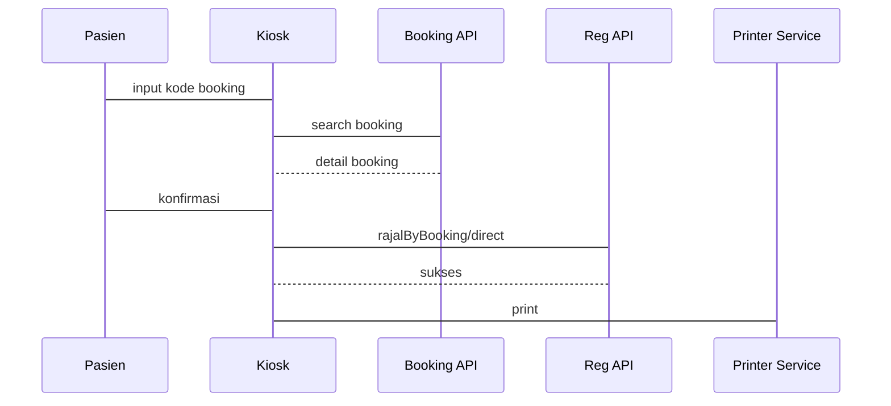

## Prompt Delegasi AI Agent — Enhancement Fitur KIOSK Self Registration Rawat Jalan

### Peran AI Agent

Anda adalah **Senior Frontend Engineer & Software Architect khusus Hospital Information System (HIS)** yang bertugas melakukan **enhancement fitur KIOSK Self Registration Rawat Jalan** pada project yang sudah berjalan.

Fokus utama pekerjaan adalah **web frontend orchestration dan integrasi endpoint**, **bukan membangun arsitektur backend baru**.

Project kiosk saat ini **sudah memiliki fitur “Ambil Antrian Pendaftaran”** yang berjalan dengan baik, termasuk mekanisme:

* pemanggilan proxy/local service,
* pencetakan thermal receipt,
* layout cetak,
* dan integrasi queue service.

Enhancement yang diminta adalah menambahkan **3 alur baru**:

1. **Check-in Pasien Booking**
2. **Go-show / Walk-in Self Registration**
3. **Penanganan Gagal Registrasi (Booking Assistance)**

---

## Tujuan Deliverable

AI Agent harus menghasilkan **all-in-one deliverable** berikut:

### 1. Analisis Workflow

* Interpretasi SOP menjadi flow digital.
* Identifikasi state, transisi, validasi, dan dependency antar layar.

### 2. Desain UI/UX Frontend

* Struktur halaman / route / component.
* User flow per use case.
* Loading, empty state, success state, dan error state.

### 3. Spesifikasi Integrasi API

* Endpoint yang dipanggil.
* Payload request.
* Mapping response ke UI.
* Validasi data sebelum submit.

### 4. Sequence Diagram

Buat sequence diagram untuk:

* Check-in booking BPJS
* Check-in booking non-BPJS
* Go-show
* Gagal registrasi → booking assistance
* Ambil antrian pendaftaran

Gunakan format **Mermaid**.

### 5. State Management & Orchestration

* State yang perlu disimpan.
* Strategi reset session kiosk setelah selesai / timeout.
* Pencegahan double submit.

### 6. Error Handling Matrix

Daftar kemungkinan kegagalan dan aksi UI yang harus dilakukan.

### 7. Acceptance Criteria

Buat acceptance criteria yang bisa langsung dipakai QA/UAT.

---

# Konteks Bisnis

KIOSK digunakan pasien untuk **pendaftaran rawat jalan mandiri** di rumah sakit.

Kiosk harus mendukung pasien:

* yang **sudah memiliki booking**,
* yang **datang langsung tanpa booking**,
* dan mengarahkan pasien ke **loket bantuan pendaftaran** apabila registrasi gagal dengan sebab apa pun.

Semua alur harus tetap mempertahankan pengalaman pengguna yang sederhana, cepat, dan minim input manual.

---

# SOP yang Harus Diimplementasikan

## 1. Check-in / Pasien Booking

### Tujuan

Pasien yang sudah memiliki booking melakukan registrasi mandiri di kiosk.

### Alur

1. Input **kode booking**

   * manual, atau
   * hasil scan QR.
2. Sistem mencari data booking.
3. Tampilkan **detail booking** untuk konfirmasi.
4. Validasi jaminan:

   * **BPJS** → wajib verifikasi biometrik.
   * **Non-BPJS** → langsung lanjut.
5. Registrasi rawat jalan.
6. Cetak bukti registrasi.

### Endpoint

#### Ambil tanggal bisnis aktif

```http
GET /api/system/business-date
```

Gunakan tanggal ini sebagai `tglBerobat`.

#### Cari booking

```http
GET /api/Booking/search/{tglBerobat}/{keyword}
```

Keterangan:

* `tglBerobat` → format `yyyy-mm-dd`
* `keyword` → hasil input manual atau hasil scan QR.

#### Registrasi dari booking

```http
POST /api/Reg/rajalByBooking/direct
```

---

## 2. Go-show / Walk-in Self Registration

### Tujuan

Pasien datang tanpa booking dan melakukan pendaftaran mandiri.

### Alur

1. Input salah satu identitas:

   * NIK / KTP,
   * Nomor MR,
   * Nomor Peserta BPJS,
   * Nomor Rujukan.
2. Sistem mencari data pasien.
3. Tampilkan hasil pencarian.
4. Pasien memilih:

   * layanan,
   * dokter,
   * jadwal yang tersedia.
5. Konfirmasi data.
6. Registrasi rawat jalan.
7. Cetak bukti registrasi.

### Endpoint

#### Cari pasien

```http
GET /api/Pasien/search/{keyword}
```

#### Registrasi walk-in

```http
POST /api/Reg/rajalWalkIn/direct
```

---

## 3. Gagal Registrasi → Booking Assistance

### Tujuan

Semua kegagalan registrasi harus diarahkan ke **loket bantuan pendaftaran** dan pasien mendapatkan nomor antrian bantuan.

### Kondisi Trigger

Berlaku untuk **semua kegagalan** dari:

* alur booking,
* alur go-show,
* kegagalan biometrik,
* kegagalan validasi BPJS,
* jadwal penuh,
* duplikasi registrasi,
* gangguan layanan backend,
* atau error lain yang menyebabkan registrasi tidak berhasil.

### Endpoint

```http
POST /api/v1/admission-queue/booking-assistance
```

### Payload

```json
{
  "bookingId": "",
  "servicePointId": "",
  "failureCode": "",
  "kioskId": "",
  "userId": ""
}
```

### Hasil yang Diharapkan

* Sistem memperoleh nomor antrian bantuan.
* Kiosk menampilkan nomor antrian.
* Kiosk mencetak tiket bantuan menggunakan mekanisme print yang sudah ada.

---

## 4. Ambil Antrian Pendaftaran

Fitur ini **sudah tersedia dan berjalan**.

AI Agent hanya perlu:

* mempertahankan kompatibilitas,
* memastikan integrasi alur baru tidak merusak fitur existing,
* dan mendokumentasikan titik integrasinya.

Jangan mendesain ulang fitur ini.

---

# Integrasi Biometrik BPJS

## Ketentuan

Mekanisme biometrik menggunakan **proxy / local service yang sama dengan printer service** yang sudah digunakan kiosk saat ini.

Bukan membuat arsitektur baru.

### Endpoint Local Service

```http
POST /biometrik
```

### Karakteristik

* Dipanggil dari web frontend ke local proxy/service.
* Akan memunculkan popup atau proses biometrik BPJS pada mesin kiosk.
* Frontend harus menunggu hasil verifikasi:

  * **SUCCESS** → lanjut registrasi.
  * **FAILED / CANCELLED / TIMEOUT** → arahkan ke booking assistance.

AI Agent harus mendesain:

* contract pemanggilan,
* state loading,
* timeout handling,
* retry policy (jika diperlukan),
* dan fallback UI apabila local service tidak dapat dihubungi.

---

# Batasan Implementasi

## Yang Boleh Dilakukan

* Menambah page / route frontend.
* Menambah component dan state management.
* Menggunakan endpoint yang sudah tersedia.
* Mengintegrasikan local proxy biometrik.
* Menggunakan mekanisme print existing.

## Yang Tidak Boleh Dilakukan

* Mengubah arsitektur backend HIS.
* Mendesain ulang sistem queue existing.
* Mengubah format dan layout print.
* Membuat service backend baru.
* Mengganti mekanisme proxy printer yang sudah berjalan.

---

# Desain Layar Minimum

## Halaman Utama

Tampilkan 3 tombol utama:

1. **Check-in Booking**
2. **Daftar Tanpa Booking**
3. **Ambil Antrian Pendaftaran**

---

## Check-in Booking

### Step 1 — Input Booking

* Input text besar.
* Tombol **Scan QR**.
* Tombol **Lanjutkan**.

### Step 2 — Konfirmasi Booking

Tampilkan:

* nama pasien,
* nomor MR,
* dokter,
* poli,
* tanggal & jam,
* jenis jaminan.

### Step 3 — Verifikasi BPJS (conditional)

Tampilkan progress:

* Menghubungkan layanan biometrik.
* Menunggu verifikasi sidik jari / wajah.
* Hasil verifikasi.

### Step 4 — Hasil Registrasi

* Nomor registrasi.
* Nomor antrian poli.
* Tombol **Cetak**.
* Tombol **Selesai**.

---

## Go-show

### Step 1 — Cari Pasien

Input keyword + pilihan jenis identitas.

### Step 2 — Pilih Pasien

Tampilkan daftar hasil pencarian.

### Step 3 — Pilih Layanan

* Poli
* Dokter
* Jadwal

### Step 4 — Konfirmasi

Ringkasan data pasien dan layanan.

### Step 5 — Hasil Registrasi

Sama seperti alur booking.

---

## Booking Assistance

Tampilkan:

* pesan bahwa registrasi tidak dapat diproses,
* nomor antrian bantuan,
* nama loket / service point,
* instruksi menuju loket,
* status cetak tiket.

---

# Failure Code Recommendation

Gunakan minimal kode berikut untuk konsistensi frontend:

| Kode                     | Deskripsi                      |
| ------------------------ | ------------------------------ |
| `BIOMETRIC_FAILED`       | Verifikasi biometrik gagal     |
| `BIOMETRIC_TIMEOUT`      | Layanan biometrik timeout      |
| `BPJS_VALIDATION_FAILED` | Validasi BPJS gagal            |
| `BOOKING_NOT_FOUND`      | Booking tidak ditemukan        |
| `SCHEDULE_FULL`          | Jadwal dokter penuh            |
| `DUPLICATE_REGISTRATION` | Sudah terdaftar hari yang sama |
| `BACKEND_ERROR`          | Gangguan layanan backend       |
| `UNKNOWN_ERROR`          | Error tidak teridentifikasi    |

---

# Sequence Diagram yang Wajib Dibuat

AI Agent **harus menyertakan Mermaid diagram** untuk:

## 1. Booking Non-BPJS



## 2. Booking BPJS + Biometrik

Harus mencakup interaksi dengan **Local Biometric Service**.

## 3. Go-show

Harus mencakup:

* pencarian pasien,
* pemilihan layanan,
* registrasi walk-in,
* pencetakan.

## 4. Gagal Registrasi

Harus mencakup:

* registrasi gagal,
* pemanggilan booking-assistance,
* penerimaan nomor antrian,
* pencetakan tiket bantuan.

---

# State Management yang Diharapkan

Minimal definisikan state berikut:

```ts
type KioskFlow =
  | 'HOME'
  | 'BOOKING_SEARCH'
  | 'BOOKING_CONFIRM'
  | 'BIOMETRIC_VERIFY'
  | 'WALKIN_SEARCH'
  | 'WALKIN_SELECT_SERVICE'
  | 'WALKIN_CONFIRM'
  | 'REGISTRATION_SUCCESS'
  | 'ASSISTANCE_QUEUE';
```

Tambahkan juga:

* `selectedPatient`
* `selectedBooking`
* `selectedDoctor`
* `selectedService`
* `registrationResult`
* `assistanceQueue`
* `errorContext`

---

# Timeout & Auto Reset

Kiosk adalah perangkat publik.

AI Agent harus mendesain:

## Auto Reset

* **60 detik** tanpa aktivitas → kembali ke halaman utama.
* Setelah **cetak berhasil** → kembali ke halaman utama dalam **10 detik**.
* Setelah **booking assistance selesai dicetak** → kembali ke halaman utama dalam **15 detik**.

Semua state sensitif harus dibersihkan saat reset.

---

# Acceptance Criteria

## Check-in Booking

* Dapat mencari booking menggunakan input manual maupun QR.
* Dapat menampilkan detail booking.
* BPJS wajib melalui biometrik.
* Non-BPJS tidak memanggil biometrik.
* Registrasi berhasil menghasilkan bukti cetak.
* Kegagalan apa pun menghasilkan nomor antrian bantuan.

## Go-show

* Dapat mencari pasien menggunakan seluruh jenis keyword yang didukung.
* Dapat memilih layanan dan dokter.
* Registrasi berhasil menghasilkan bukti cetak.
* Kegagalan menghasilkan nomor antrian bantuan.

## Booking Assistance

* Endpoint dipanggil otomatis saat registrasi gagal.
* Payload sesuai spesifikasi.
* Nomor antrian tampil di layar.
* Tiket bantuan tercetak.

## Existing Queue Feature

* Fitur “Ambil Antrian Pendaftaran” tetap dapat digunakan tanpa perubahan perilaku.

---

# Format Output yang Harus Dihasilkan AI Agent

Susun jawaban dengan urutan berikut:

1. **Ringkasan Enhancement**
2. **Analisis Workflow**
3. **Desain UI/UX**
4. **Daftar Route / Page**
5. **Spesifikasi API Integration**
6. **Sequence Diagram (Mermaid)**
7. **State Management Design**
8. **Error Handling Matrix**
9. **Timeout & Session Reset**
10. **Acceptance Criteria**
11. **Catatan Integrasi ke Project Existing**

Gunakan **Bahasa Indonesia** sebagai bahasa utama dokumentasi dan penjelasan teknis.
