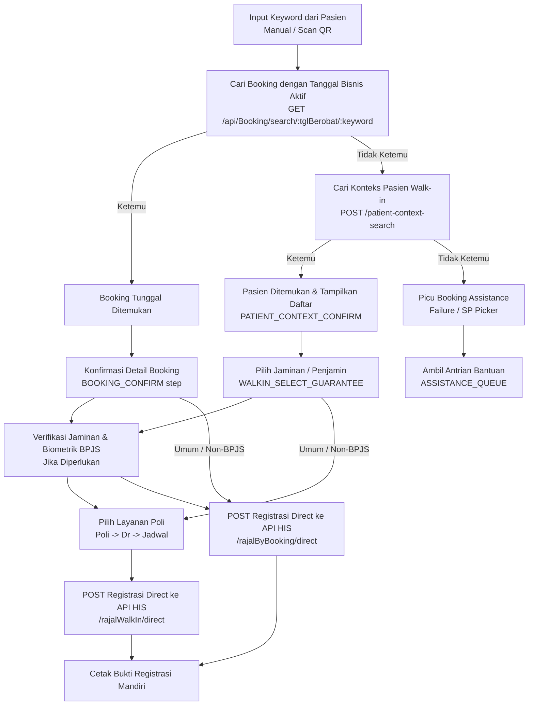
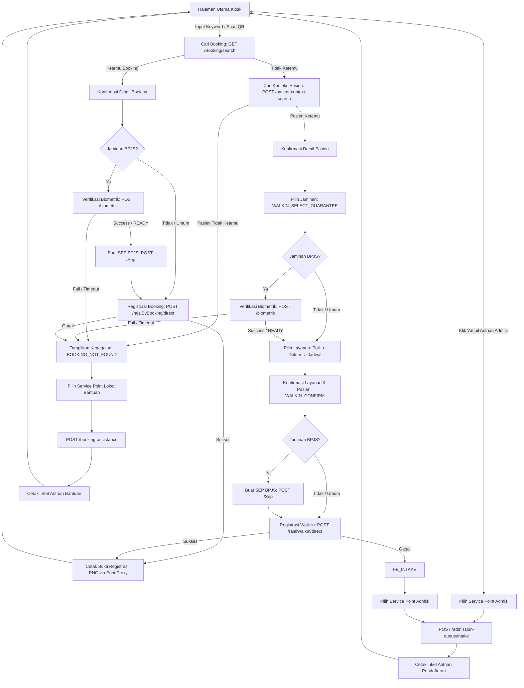
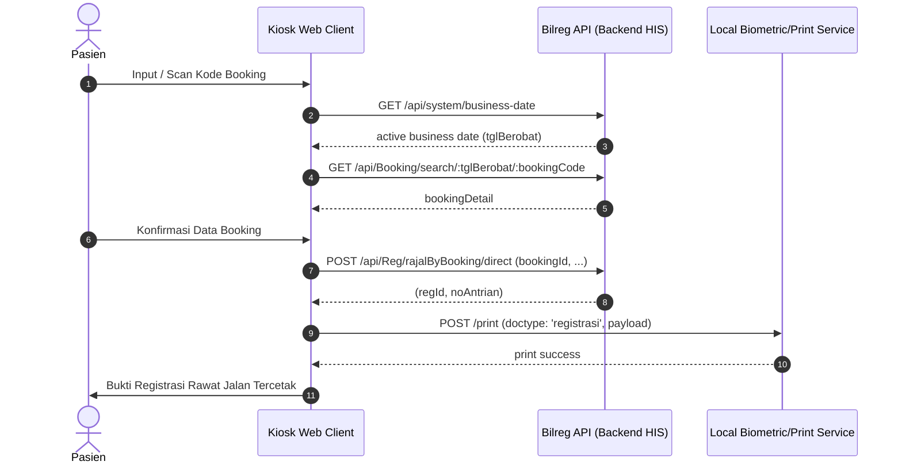
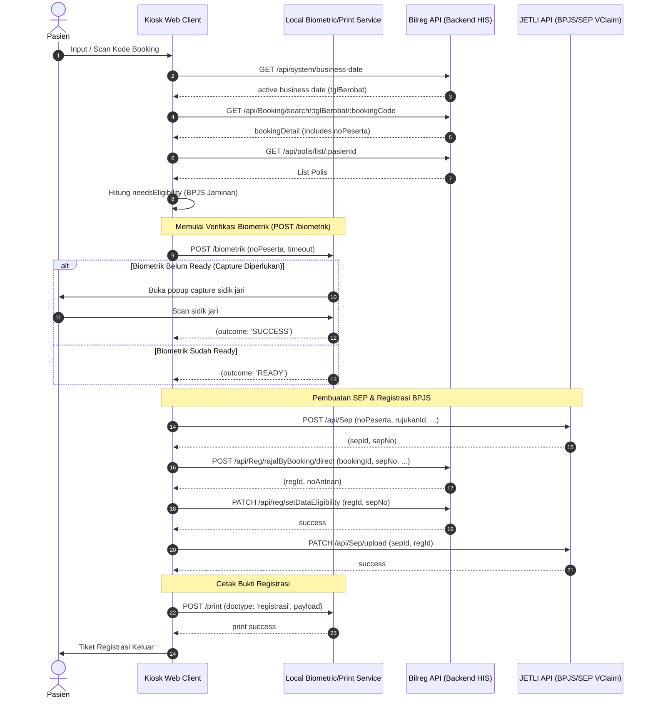
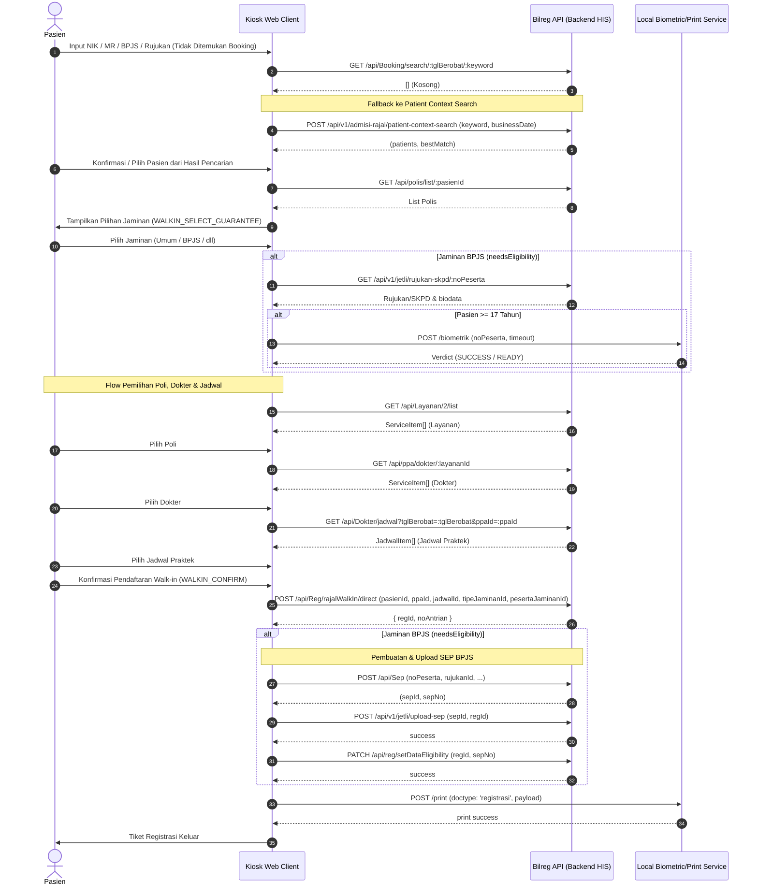
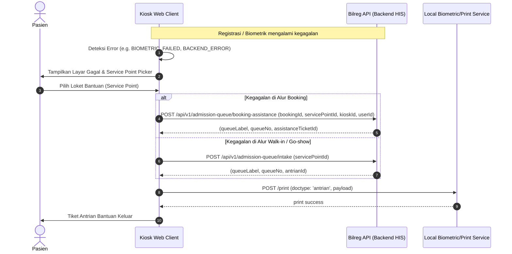

# Kiosk Self Registration Rawat Jalan — Arsitektur & Spesifikasi Alur (Unified Search-First)

Dokumen ini mendokumentasikan spesifikasi arsitektur, alur kerja (workflow), integrasi API, dan perancangan UI/UX untuk fitur **Kiosk Self Registration Rawat Jalan** pada sistem Admission Queue.

Berbeda dengan alur pendaftaran mandiri tradisional yang memisahkan tombol masuk sejak awal, Kiosk ini menggunakan pendekatan **Unified Search-First**—menggunakan satu input pencarian tunggal di halaman utama yang secara otomatis bercabang ke alur pencarian booking maupun pencarian data pasien (walk-in) secara cerdas (cascade search).

---

## 1. Analisis Workflow & Cascade Search

Pendaftaran mandiri di Kiosk diorkestrasikan melalui satu kolom pencarian terpadu di halaman utama (`KioskHome.vue`). Alur pencarian didefinisikan sebagai berikut:



### Detail Tahapan Cascade Search:

1. **Pencarian Booking (Prioritas Pertama)**:
   * Kiosk mengambil tanggal operasional aktif melalui `GET /api/system/business-date`.
   * Melakukan pencarian menggunakan keyword yang diinput (bisa berupa Kode Booking MJKN yang di-decode dari QR base64, nomor rujukan, NIK, atau MR).
   * Endpoint: `GET /api/Booking/search/{tglBerobat}/{keyword}`.
   * **Jika ditemukan tepat 1 booking**: Kiosk langsung mengalihkan pasien ke layar **Konfirmasi Booking** (`BOOKING_CONFIRM`).

2. **Pencarian Konteks Pasien (Prioritas Kedua / Fallback)**:
   * Jika pencarian booking mengembalikan hasil kosong (0 matches), sistem tidak langsung menampilkan error, melainkan melakukan fallback otomatis ke pencarian data pasien (untuk pendaftaran Walk-in / Go-show).
   * Endpoint: `POST /api/v1/admisi-rajal/patient-context-search` dengan payload keyword dan businessDate.
   * **Jika ditemukan pasien**: Sistem mengalihkan ke layar **Konfirmasi Pasien** (`PATIENT_CONTEXT_CONFIRM`) yang menampilkan informasi ringkas pasien beserta tombol konfirmasi untuk memulai pendaftaran langsung (Walk-in).
   * **Jika tidak ditemukan pasien**: Sistem langsung menganggap proses pencarian gagal dan masuk ke layar **Failure Step** (`FAILURE`) dengan kode error `BOOKING_NOT_FOUND`, di mana pasien ditawarkan untuk memilih Service Point loket pendaftaran manual.
   * **Pilihan Jaminan Terlebih Dahulu**: Setelah mengonfirmasi pasien, pasien diarahkan ke layar **Pilih Jaminan** (`WALKIN_SELECT_GUARANTEE`). Pasien harus memilih jenis penjamin (Umum vs BPJS) terlebih dahulu sebelum memilih poliklinik dan dokter. Hal ini memastikan kelayakan asuransi (seperti rujukan/SKDP BPJS dan verifikasi biometrik sidik jari) diverifikasi sejak dini sebelum pasien memilih jadwal praktik.

---

## 2. Diagram Alur & Sequence Diagram

### 2.1 Diagram Alur Keseluruhan (Flow Diagram)



---

### 2.2 Sequence Diagram: Booking Non-BPJS (Umum)



---

### 2.3 Sequence Diagram: Booking BPJS + Biometrik



---

### 2.4 Sequence Diagram: Go-Show / Walk-In (Cascade Fallback)



---

### 2.5 Sequence Diagram: Gagal Registrasi (Booking Assistance Fallback)



---

## 3. Detail Layar & UI/UX

Kiosk berpindah layar berdasarkan perubahan state `flow` yang diatur oleh `useKioskRegistration`.

1. **`HOME` (`KioskHome.vue`)**:
   * Menampilkan area pemutaran video iklan & informasi layanan RS di sebelah kiri (dikelola oleh `useKioskMediaInfo`).
   * Input teks utama dengan autofocus di sebelah kanan, didukung komponen `VirtualKeyboard` sentuh untuk mempermudah penulisan data pasien.
   * Mendukung input manual maupun input otomatis dari pemindaian barcode/QR code (melalui simulasi pembacaan hardware).
   * Menyediakan tombol alternatif "Ambil Antrian Admisi" untuk langsung mengambil nomor antrian pendaftaran manual tanpa melalui proses verifikasi data pasien/booking.

2. **`BOOKING_SEARCH` / `PATIENT_CONTEXT_SEARCH`**:
   * Layar transisi (loading state) ketika aplikasi sedang mengirim data pencarian ke backend API dan menunggu kembalinya payload.

3. **`BOOKING_CONFIRM` (`BookingConfirmStep.vue`)**:
   * Menampilkan rincian booking yang berhasil ditemukan: Nama Pasien, Nomor Rekam Medis (MR), Dokter, Poliklinik, Tanggal & Jam Praktek, serta jenis penjamin (Jaminan).
   * Jika jaminan terdeteksi sebagai BPJS dan membutuhkan eligibility check, sistem menampilkan pesan peringatan mengenai keharusan melakukan verifikasi sidik jari di langkah berikutnya.

4. **`PATIENT_CONTEXT_CONFIRM` (`PatientContextConfirmStep.vue`)**:
   * Ditampilkan jika pencarian booking nihil namun data pasien ditemukan di database HIS.
   * Menampilkan daftar pasien yang cocok dengan keyword pencarian. Pasien diminta menekan tombol konfirmasi di baris datanya untuk menyatakan "Ya, ini saya" untuk masuk ke alur pendaftaran walk-in langsung.

5. **`WALKIN_SELECT_GUARANTEE` (`WalkinSelectGuaranteeStep.vue`)**:
   * Ditampilkan setelah konfirmasi data pasien walk-in.
   * Pasien diminta memilih jenis penjamin (Umum / Jaminan Kesehatan aktif yang terdaftar di HIS / BPJS Kesehatan fallback).
   * Menentukan `needsEligibility` untuk proses eligibility BPJS dan verifikasi biometrik selanjutnya.

6. **`BIOMETRIC_VERIFY` (`BiometricStep.vue`)**:
   * Layar tunggu verifikasi sidik jari. Sistem memanggil local service melalui `POST /biometrik` yang akan mengaktifkan hardware scanner dan menampilkan aplikasi capture bawaan BPJS di atas layar kiosk web.
   * Layar ini memblokir interaksi pengguna lain guna mencegah double-trigger.

7. **`WALKIN_SELECT_SERVICE` (`WalkinServiceStep.vue`)**:
   * Wizard pemilihan klinik dan dokter rawat jalan walk-in yang terdiri dari 3 tahapan query internal:
     1. Memilih Poliklinik tujuan.
     2. Memilih Dokter spesialis yang bertugas hari ini pada poliklinik tersebut.
     3. Memilih Jam Jadwal Praktek dokter yang tersedia.

8. **`WALKIN_CONFIRM` (`WalkinConfirmStep.vue`)**:
   * Layar rangkuman data pasien walk-in beserta poliklinik, dokter, dan jadwal yang telah dipilih pada step sebelumnya untuk konfirmasi akhir.

9. **`REGISTRATION_SUCCESS` (`RegistrationSuccessStep.vue`)**:
   * Menampilkan pesan sukses pendaftaran, nomor rekam medis, dan **Nomor Antrian Poli** yang dicetak oleh HIS.
   * Menampilkan status cetak thermal receipt dan hitung mundur otomatis untuk kembali ke menu utama.

10. **`FAILURE` (`FailureStep.vue`)**:
    * Menampilkan pesan kegagalan secara detail (misalnya: sidik jari tidak dikenali, jadwal dokter penuh, atau backend error).
    * Menyediakan daftar Service Point (Loket Pendaftaran) yang aktif di mesin Kiosk saat itu agar pasien dapat memilih salah satu loket bantuan admisi.

11. **`ASSISTANCE_QUEUE` (`AssistanceQueueStep.vue`)**:
    * Menampilkan nomor tiket bantuan admisi yang berhasil dicetak sebagai tindak lanjut atas kegagalan registrasi mandiri.

---

## 4. Spesifikasi API & Kontrak Integrasi

### 4.1 Pencarian Booking
* **HTTP Method**: `GET`
* **Path**: `/api/Booking/search/{tglBerobat}/{keyword}`
* **Response Schema**:
  ```ts
  export const bookingSearchItemSchema = z.object({
    bookingId: z.string(),
    bookingDate: z.string(),
    reg: z.object({
      regId: z.string(),
      pasienId: z.string(),
      pasienName: z.string(),
    }),
    layanan: z.object({
      layananId: z.string(),
      layananName: z.string(),
    }),
    dokter: z.object({
      ppaId: z.string(),
      ppaName: z.string(),
      isDefault: z.boolean(),
    }),
    tglBerobat: z.string(),
    jamPraktek: z.string(),
    noAntrian: z.number(),
    extAppRef: z.object({
      extAppName: z.string(),
      reffId: z.string(),
      checkInQr: z.string(),
    }),
  })
  ```

### 4.2 Pencarian Konteks Pasien (Patient Context Search)
* **HTTP Method**: `POST`
* **Path**: `/api/v1/admisi-rajal/patient-context-search`
* **Request Payload**:
  ```json
  {
    "keyword": "31710XXXXXXXXXXX",
    "businessDate": "2026-08-14"
  }
  ```
* **Response Schema**:
  ```ts
  export const patientContextSearchResponseSchema = z.object({
    businessDate: z.string(),
    bookings: z.object({
      items: z.array(z.unknown()),
      total: z.number(),
      hasMore: z.boolean(),
    }),
    registrations: z.object({
      items: z.array(z.unknown()),
      total: z.number(),
      hasMore: z.boolean(),
    }),
    patients: z.object({
      items: z.array(patientContextItemSchema),
      total: z.number(),
      hasMore: z.boolean(),
    }),
    bestMatch: patientContextItemSchema.nullable(),
    canCreatePatient: z.boolean(),
  })
  ```

### 4.3 Registrasi Direct dari Booking
* **HTTP Method**: `POST`
* **Path**: `/api/Reg/rajalByBooking/direct`
* **Request Payload**:
  ```json
  {
    "bookingId": "BK-100293",
    "pasienId": "P-092301",
    "tipeJaminanId": "00001",
    "noPeserta": "0001293849182",
    "userId": "hidokkiosk"
  }
  ```
* **Response**: `{ regId: string, noAntrian: number }`

### 4.4 Registrasi Direct Walk-In / Go-Show
* **HTTP Method**: `POST`
* **Path**: `/api/Reg/rajalWalkIn/direct`
* **Request Payload**:
  ```json
  {
    "pasienId": "P-092301",
    "poliId": "PL-002",
    "ppaId": "DR-012",
    "jadwalId": "JD-001",
    "tglBerobat": "2026-08-14",
    "tipeJaminanId": "00001",
    "noPeserta": "0001293849182",
    "userId": "hidokkiosk"
  }
  ```
* **Response**: `{ regId: string, noAntrian: number }`

### 4.5 Booking Assistance Fallback
* **HTTP Method**: `POST`
* **Path**: `/api/v1/admission-queue/booking-assistance`
* **Request Payload**:
  ```json
  {
    "bookingId": "BK-100293",
    "servicePointId": "SP-002",
    "kioskId": "kiosk-front-01",
    "userId": "hidokkiosk"
  }
  ```
* **Response**: `AdmissionQueueIntakeResponse` (berisi nomor antrian bantuan loket)

### 4.6 Daftar Poliklinik (Layanan)
* **HTTP Method**: `GET`
* **Path**: `/api/Layanan/{instalasiDkId}/list` (dengan `instalasiDkId = 2` untuk Rawat Jalan)
* **Query Parameters**: None
* **Response Schema**: `z.array(serviceItemSchema)` (hasil pemetaan dari field `layananId` ke `id`, dan `layananName` ke `name` setelah difilter `isAktif = true`)
  ```json
  [
    { "id": "PL-001", "name": "Poli Anak" },
    { "id": "PL-002", "name": "Poli Dalam" }
  ]
  ```

### 4.7 Daftar Dokter per Poliklinik
* **HTTP Method**: `GET`
* **Path**: `/api/ppa/dokter/{layananId}`
* **Query Parameters**: None (Layanan ID diekstrak dari path)
* **Response Schema**: `z.array(serviceItemSchema)`
  ```json
  [
    { "id": "DR-001", "name": "dr. Budi, Sp.A" }
  ]
  ```

### 4.8 Jadwal Praktek Dokter
* **HTTP Method**: `GET`
* **Path**: `/api/Dokter/jadwal`
* **Query Parameters**:
  * `tglBerobat`: `yyyy-mm-dd`
  * `ppaId`: ID Dokter terpilih
* **Response Schema**: `z.array(jadwalItemSchema)`
  ```json
  [
    {
      "jadwalId": "JD-001",
      "ppaId": "DR-001",
      "jamPraktek": "08:00 - 12:00",
      "sisaKuota": 15
    }
  ]
  ```

### 4.9 Praktek Dokter (PraktekDokter/dokter & PraktekDokter/groupSpesialis)

Kedua API endpoint tersebut (`PraktekDokter/dokter` dan `PraktekDokter/groupSpesialis`) digunakan untuk mendapatkan jadwal praktik dokter. Keduanya mengembalikan data dengan struktur array yang sama, yaitu array dari objek `ListPraktekDokter` yang divalidasi dan ditransformasikan oleh `jadwal.ts:171-184` di frontend.

---

#### 4.9.1 Endpoint: /PraktekDokter/dokter

Digunakan untuk mendapatkan daftar jadwal praktik dari satu dokter tertentu dalam rentang waktu yang didefinisikan.

* **HTTP Method**: `POST`
* **Content-Type**: `application/json`
* **Base API Service**: `bilregApi`

##### Request Payload (`PayloadListPraktekDokter`):

```json
{
  "tglYmdAwal": "2026-08-15",
  "tglYmdAkhir": "2026-08-15",
  "dokterId": "D001"
}
```

##### Response Payload (`Array<ListPraktekDokter>`):

```json
[
  {
    "tanggal": "2026-08-15",
    "dokter": {
      "dokterId": "D001",
      "dokterName": "dr. John Doe, Sp.A"
    },
    "layanan": {
      "layananId": "L002",
      "layananName": "Poliklinik Anak"
    },
    "jamMulaiPraktek": "08:00",
    "jamSelesaiPraktek": "12:00",
    "jumlahPasien": 5,
    "maxPasien": 30
  }
]
```

---

#### 4.9.2 Endpoint: /PraktekDokter/groupSpesialis

Digunakan untuk mendapatkan daftar jadwal praktik dari semua dokter yang tergabung dalam satu kelompok spesialisasi tertentu dalam rentang waktu yang didefinisikan.

* **HTTP Method**: `POST`
* **Content-Type**: `application/json`
* **Base API Service**: `bilregApi`

##### Request Payload (`PayloadListPraktekDokterSp`):

```json
{
  "tglYmdAwal": "2026-08-15",
  "tglYmdAkhir": "2026-08-29",
  "groupSpesialisId": "SP-001"
}
```

##### Response Payload (`Array<ListPraktekDokter>`):

```json
[
  {
    "tanggal": "2026-08-15",
    "dokter": {
      "dokterId": "D001",
      "dokterName": "dr. John Doe, Sp.A"
    },
    "layanan": {
      "layananId": "L002",
      "layananName": "Poliklinik Anak"
    },
    "jamMulaiPraktek": "08:00",
    "jamSelesaiPraktek": "12:00",
    "jumlahPasien": 5,
    "maxPasien": 30
  },
  {
    "tanggal": "2026-08-15",
    "dokter": {
      "dokterId": "D003",
      "dokterName": "dr. Alice Brown, Sp.A"
    },
    "layanan": {
      "layananId": "L002",
      "layananName": "Poliklinik Anak"
    },
    "jamMulaiPraktek": "13:00",
    "jamSelesaiPraktek": "17:00",
    "jumlahPasien": 2,
    "maxPasien": 20
  }
]
```

---

#### 4.9.3 Validasi & Skema Data (Zod & Schema)

##### 1. Skema Validasi Zod (Zod Response Schema)

Didefinisikan pada file `jadwal.ts`:

```typescript
import { z } from 'zod'
import { dokterHeaderSchema } from '../../BillingBase/types/doctor'
import { layananHeader } from '../../BillingBase/types/layanan'

// Schema Output Akhir setelah Transformasi/Adaptasi
export const listPraktekDokterOutputSchema = z.object({
  tanggal: z.string(),                 // Format: YYYY-MM-DD
  dokter: z.object({                   // Mengacu ke dokterHeaderSchema
    dokterId: z.string(),
    dokterName: z.string(),
  }),
  layanan: z.object({                  // Mengacu ke layananHeader
    layananId: z.string(),
    layananName: z.string(),
  }),
  jamMulaiPraktek: z.string(),         // Format: HH:MM
  jamSelesaiPraktek: z.string(),       // Format: HH:MM
  jumlahPasien: z.number(),            // Jumlah pasien saat ini yang terdaftar
  maxPasien: z.number(),               // Kuota maksimum pasien
})

// Schema Response Array
export const listPraktekDokterResponseSchema = z.array(listPraktekDokterOutputSchema)
```

---

## 5. State Management & State Machine

Siklus transisi layar di Kiosk diatur secara ketat oleh state machine di `flow.ts` guna mencegah kesalahan navigasi atau data yang tercampur antar sesi.

### State Layar (`KioskFlow`)
```ts
type KioskFlow =
  | 'HOME'
  | 'BOOKING_SEARCH'
  | 'BOOKING_CONFIRM'
  | 'PATIENT_CONTEXT_SEARCH'
  | 'PATIENT_CONTEXT_CONFIRM'
  | 'WALKIN_SELECT_GUARANTEE'
  | 'BIOMETRIC_VERIFY'
  | 'WALKIN_SELECT_SERVICE'
  | 'WALKIN_CONFIRM'
  | 'REGISTRATION_SUCCESS'
  | 'FAILURE'
  | 'ASSISTANCE_QUEUE'
```

### Transisi yang Valid (`FLOW_TRANSITIONS`)
```ts
export const FLOW_TRANSITIONS: Record<KioskFlow, readonly KioskFlow[]> = {
  HOME: [
    'BOOKING_SEARCH',
    'BOOKING_CONFIRM',
    'PATIENT_CONTEXT_SEARCH',
    'PATIENT_CONTEXT_CONFIRM',
    'FAILURE',
  ],
  BOOKING_SEARCH: [
    'BOOKING_CONFIRM',
    'PATIENT_CONTEXT_SEARCH',
    'PATIENT_CONTEXT_CONFIRM',
    'FAILURE',
  ],
  BOOKING_CONFIRM: ['BIOMETRIC_VERIFY', 'REGISTRATION_SUCCESS', 'FAILURE'],
  PATIENT_CONTEXT_SEARCH: ['PATIENT_CONTEXT_CONFIRM', 'FAILURE'],
  PATIENT_CONTEXT_CONFIRM: ['WALKIN_SELECT_GUARANTEE', 'FAILURE', 'HOME'],
  WALKIN_SELECT_GUARANTEE: ['WALKIN_SELECT_SERVICE', 'BIOMETRIC_VERIFY', 'FAILURE', 'HOME'],
  BIOMETRIC_VERIFY: ['REGISTRATION_SUCCESS', 'WALKIN_SELECT_SERVICE', 'FAILURE'],
  WALKIN_SELECT_SERVICE: ['WALKIN_CONFIRM', 'FAILURE'],
  WALKIN_CONFIRM: ['BIOMETRIC_VERIFY', 'REGISTRATION_SUCCESS', 'FAILURE'],
  REGISTRATION_SUCCESS: ['HOME'],
  FAILURE: ['ASSISTANCE_QUEUE'],
  ASSISTANCE_QUEUE: ['HOME'],
}
```

### Aturan Pencegahan Submit Ganda (Double-Submit Protection)
* Kiosk mempertahankan state `submitting = ref(false)`.
* Ketika data dikirimkan (registrasi, biometrik, pengambilan antrean), `submitting` diubah menjadi `true`.
* Semua tombol aksi utama (`Lanjutkan`, `Cetak`, `Coba Lagi`) di layar di-disable jika `submitting` bernilai `true`.

---

## 6. Timeout & Sesi Auto Reset

Sebagai perangkat publik, Kiosk harus dapat membersihkan informasi sensitif pasien dan kembali ke halaman utama jika ditinggal oleh pengguna:

1. **Auto Reset Idle (60 Detik)**:
   * Setiap aktivitas sentuh atau keyboard akan memperbarui parameter `lastActivity`.
   * Jika tidak ada aktivitas selama **60 detik** di luar layar `HOME`, Kiosk otomatis melakukan `goHome()`.

2. **Auto Reset Sukses (10 Detik)**:
   * Setelah tiket registrasi rawat jalan sukses dicetak di layar `REGISTRATION_SUCCESS`, sistem otomatis kembali ke `HOME` dalam waktu **10 detik**.

3. **Auto Reset Bantuan (15 Detik)**:
   * Setelah antrean bantuan berhasil dicetak di layar `ASSISTANCE_QUEUE`, sistem otomatis kembali ke `HOME` dalam waktu **15 detik**.

4. **Pembersihan Data Sensitif**:
   * Prosedur `goHome()` wajib membersihkan seluruh variabel state berikut agar tidak bocor ke pasien berikutnya:
     * `selectedBooking` & `bookingDetail`
     * `selectedPatient` & `walkinEligibility`
     * `selectedService` & `registrationResult`
     * `assistanceTicket`
     * `patientContextResult`
     * `errorContext` & `biometricVerdict`
     * Token autentikasi in-memory (`tokenAuth`) dibersihkan jika Kiosk di-reload secara menyeluruh.
