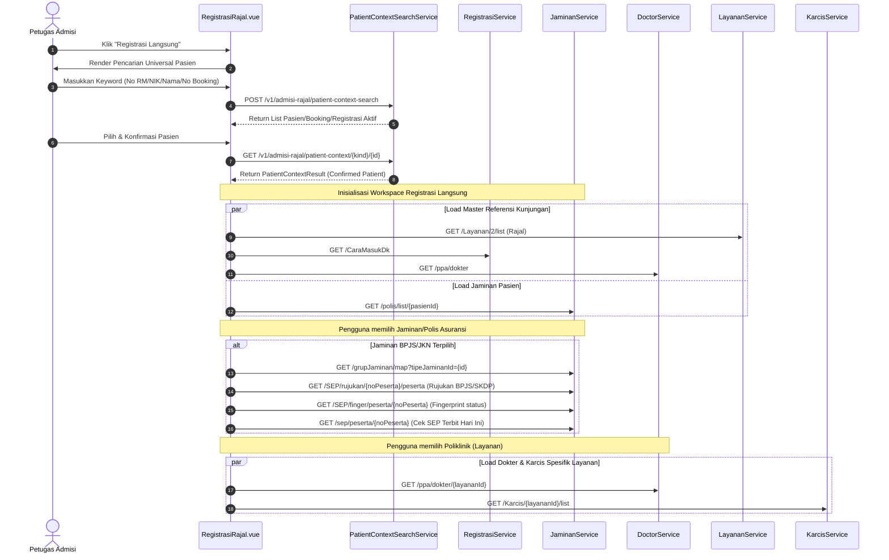

# Spesifikasi Alur dan Kontrak API: Registrasi Langsung Tanpa Antrean

Dokumen ini mendefinisikan spesifikasi teknis untuk alur **Registrasi Langsung Tanpa Antrean (Direct Outpatient Registration)** pada modul Admisi Rawat Jalan. Alur ini digunakan oleh petugas admisi untuk mendaftarkan pasien secara langsung ke poliklinik tujuan tanpa melalui sistem antrean loket (bypassing loket workstation claim).

---

## 1. Tinjauan Alur Kerja (Workflow Overview)

Registrasi Langsung memiliki perbedaan utama dengan Registrasi Berbasis Antrean (Queued Registration):

- Bypassing loket/loket session claim.
- Tidak membutuhkan nomor antrean admisi (`admissionAntrianId` / `admissionNoUrut`).
- Pasien dicari menggunakan pencarian universal (Universal Patient Context Search).
- Registrasi dapat dilakukan dalam dua skenario:
  1. **Walk-In**: Pasien datang langsung dan belum memiliki booking sebelumnya.
  2. **By Booking**: Pasien telah melakukan pemesanan (booking) via MJKN atau platform lain.

---

## 2. Alur Render Data (Data Rendering Flow)

Sebelum formulir pendaftaran siap diisi, sistem memuat berbagai referensi data sebagai berikut:



---

## 3. Alur Input Pengguna & Validasi (User Input & Validation Flow)

1. **Pencarian & Konfirmasi Pasien**:
   - Petugas mencari pasien via `UniversalPatientContextSearch`.
   - Data pasien yang terkonfirmasi menjadi dasar pengisian formulir.
2. **Pengisian Data Layanan (Kunjungan)**:
   - **Poliklinik (Layanan)**: Mengaktifkan pemuatan daftar Dokter dan Karcis yang terafiliasi dengan poliklinik tersebut.
   - **Dokter**: Memuat jadwal praktik dokter pada hari yang bersangkutan.
   - **Karcis**: Menentukan biaya retribusi/karcis administrasi.
   - **Cara Masuk & Rujukan**: Jika cara masuk yang dipilih bernilai rujukan (misal: Rujukan Puskesmas, RS Lain), kolom referensi asal rujukan akan diaktifkan dan divalidasi.
3. **Pemuatan Jaminan (Asuransi)**:
   - Petugas memilih salah satu jaminan pasien yang aktif atau mendaftarkan polis baru.
   - Jika tipe jaminan memerlukan verifikasi eligibilitas (BPJS/JKN):
     - Sistem memvalidasi kesesuaian nomor peserta.
     - Sistem mengambil data rujukan BPJS / surat kontrol (SKDP) aktif.
     - Jika rujukan ditemukan, data cara masuk dan asal perujuk otomatis terisi.
     - Dilakukan pengecekan sidik jari (fingerprint biometrics) untuk keperluan penerbitan SEP.
4. **Penerbitan SEP (Surat Eligibilitas Peserta)**:
   - Petugas melengkapi data eligibilitas via `EligibilityForm`.
   - Mengirim request pembuatan SEP ke sistem bridging BPJS (Jetli API).
5. **Penyimpanan Registrasi**:
   - Validasi data mandatori (NIK wajib diisi; jika kosong, tampilkan dialog pengisian data sosial).
   - Melakukan submit registrasi tanpa menyertakan context antrean admisi.
   - Jika registrasi sukses, sistem akan mengaitkan SEP yang telah diterbitkan (Upload SEP).

---

## 4. Daftar Endpoint API yang Dipanggil

Berikut adalah daftar endpoint API yang digunakan secara khusus dalam alur Registrasi Langsung:

| Endpoint                                       | Method  | API Name    | Deskripsi                                                                                |
| :--------------------------------------------- | :------ | :---------- | :--------------------------------------------------------------------------------------- |
| `/v1/admisi-rajal/patient-context-search`      | `POST`  | `bilregApi` | Melakukan pencarian data pasien, booking, atau registrasi aktif secara terpadu.          |
| `/v1/admisi-rajal/patient-context/{kind}/{id}` | `GET`   | `bilregApi` | Mengonfirmasi detail entitas terpilih (Booking, Registration, atau Patient).             |
| `/Layanan/{instalasiDkId}/list`                | `GET`   | `bilregApi` | Mengambil daftar poliklinik berdasarkan instalasi (e.g. instalasiDkId = 2 untuk Rajal).  |
| `/CaraMasukDk`                                 | `GET`   | `bilregApi` | Mengambil opsi cara masuk pasien (rujukan, datang sendiri, dsb).                         |
| `/ppa/dokter`                                  | `GET`   | `bilregApi` | Mengambil daftar keseluruhan praktisi medis (Dokter/PPA).                                |
| `/ppa/dokter/{layananId}`                      | `GET`   | `bilregApi` | Mengambil daftar dokter yang bertugas di poliklinik terpilih.                            |
| `/Karcis/{layananId}/list`                     | `GET`   | `bilregApi` | Mengambil daftar karcis/biaya kartu sesuai layanan terpilih.                             |
| `/polis/list/{pasienId}`                       | `GET`   | `bilregApi` | Mengambil daftar polis asuransi/jaminan yang dimiliki pasien.                            |
| `/grupJaminan`                                 | `GET`   | `jetliApi`  | Memvalidasi pemetaan tipe jaminan ke grup jaminan BPJS (`/grupJaminan/map`).             |
| `/sep/peserta/{noPeserta}`                     | `GET`   | `jetliApi`  | Mencari data riwayat SEP pasien berdasarkan nomor peserta untuk mendeteksi SEP hari ini. |
| `/SEP/finger/peserta/{noPeserta}`              | `GET`   | `jetliApi`  | Memeriksa validitas status fingerprint biometrik BPJS pasien.                            |
| `/SEP/rujukan/{noPeserta}/peserta`             | `GET`   | `jetliApi`  | Mengambil referensi rujukan & SKDP aktif dari BPJS berdasarkan nomor peserta.            |
| `/Sep`                                         | `POST`  | `jetliApi`  | Menerbitkan Surat Eligibilitas Peserta (SEP) baru secara online ke BPJS.                 |
| `/Sep/upload`                                  | `PATCH` | `jetliApi`  | Mengaitkan (upload) `sepId` dengan `regId` setelah registrasi berhasil disimpan.         |
| `/reg/setDataEligibility`                      | `PATCH` | `bilregApi` | Menyimpan nomor SEP/SJP secara permanen ke dalam catatan registrasi billing.             |
| `/reg/rajalWalkIn/direct`                      | `POST`  | `bilregApi` | Menyimpan registrasi rawat jalan mandiri (Walk-In) langsung tanpa antrean admisi.        |
| `/reg/rajalByBooking/direct`                   | `POST`  | `bilregApi` | Menyimpan registrasi rawat jalan berdasarkan booking langsung tanpa antrean admisi.      |

---

## 5. Kontrak API (API Contracts & Schemas)

Seluruh validasi payload dan response menggunakan pustaka **Zod** pada sisi frontend.

### A. Patient Context Search

Digunakan untuk pencarian awal pasien.

- **Endpoint**: `/v1/admisi-rajal/patient-context-search`
- **Method**: `POST`
- **Payload Schema (`patientContextSearchRequestSchema`)**:

```typescript
const patientContextSearchRequestSchema = z.object({
  keyword: z.string().trim().min(1),
  businessDate: z.string().regex(/^\d{4}-\d{2}-\d{2}$/), // Format: YYYY-MM-DD
  scope: z.enum(['All', 'Booking', 'Registration', 'Patient']).default('All'),
  limitPerType: z.number().int().min(1).max(10).default(10),
  suggestedBookingId: z.string().nullable().optional(),
  suggestedRegistrationId: z.string().nullable().optional(),
  suggestedPatientId: z.string().nullable().optional(),
})
```

- **Response Schema (`patientContextSearchResponseSchema`)**:

```typescript
const patientContextResultSchema = z.object({
  kind: z.enum(['Booking', 'Registration', 'Patient']),
  id: z.string(),
  patientName: z.string(),
  patientId: z.string().nullable(),
  birthDate: z.string().nullable(),
  gender: z.string().nullable(),
  locality: z.string().nullable(),
  maskedNik: z.string().nullable(),
  maskedPhone: z.string().nullable(),
  visitDate: z.string().nullable(),
  visitTime: z.string().nullable(),
  serviceName: z.string().nullable(),
  doctorName: z.string().nullable(),
  state: z.string(),
  bookingId: z.string().nullable(),
  registrationId: z.string().nullable(),
  matchType: z.string(),
  isExactMatch: z.boolean(),
  rank: z.number(),
  warnings: z.array(z.string()),
})

const patientContextGroupSchema = z.object({
  items: z.array(patientContextResultSchema),
  total: z.number().int().nonnegative(),
  hasMore: z.boolean(),
})

const patientContextSearchResponseSchema = z.object({
  businessDate: z.string(),
  bookings: patientContextGroupSchema,
  registrations: patientContextGroupSchema,
  patients: patientContextGroupSchema,
  bestMatch: patientContextResultSchema.nullable(),
  canCreatePatient: z.boolean(),
})
```

### B. Registrasi Langsung Walk-In

Digunakan untuk menyimpan registrasi pasien baru rawat jalan tanpa antrean loket.

- **Endpoint**: `/reg/rajalWalkIn/direct`
- **Method**: `POST`
- **Payload Schema (`payloadDirectRegisterRajalWalkInSchema`)**:

```typescript
const payloadDirectRegisterRajalWalkInSchema = z.object({
  pasienId: z.string().min(1, 'Pasien ID required'),
  userId: z.string().min(1, 'User ID required'),
  tipeJaminanId: z.string().min(1, 'Tipe jaminan required'),
  caraMasukDkId: z.string().min(1, 'Cara masuk required'),
  rujukanId: z.string(), // Kosongkan jika tidak ada rujukan
  dokterId: z.string().min(1, 'Dokter required'),
  layananId: z.string().min(1, 'Layanan required'),
  jamPraktek: z.string().regex(/^([0-1]?[0-9]|2[0-3]):[0-5][0-9]$/, 'Format HH:MM'),
  karcisId: z.string().min(1, 'Karcis required'),
  pesertaJaminanId: z.string(), // No Kartu Asuransi / No BPJS (jika non-umum)
})
```

- **Response Schema (`returnCreateWalkInSchema`)**:

```typescript
const returnCreateWalkInSchema = z.object({
  regId: z.string(), // ID Registrasi yang terbentuk (Format: RGXXXXXXXX)
  noAntrian: z.number(), // Nomor urut pelayanan poliklinik rawat jalan
})
```

### C. Registrasi Langsung Melalui Booking

Digunakan untuk menyimpan registrasi rawat jalan langsung yang datanya diambil dari data pemesanan (booking).

- **Endpoint**: `/reg/rajalByBooking/direct`
- **Method**: `POST`
- **Payload Schema (`payloadDirectRegisterRajalByBookingSchema`)**:

```typescript
const payloadDirectRegisterRajalByBookingSchema = z.object({
  bookingId: z.string().min(1, 'Booking ID required'),
  userId: z.string().min(1, 'User ID required'),
  karcisId: z.string().min(1, 'Karcis ID required'),
  caraMasukDkId: z.string().min(1, 'Cara masuk ID required'),
  rujukanId: z.string(),
  tipeJaminanId: z.string().min(1, 'Tipe jaminan ID required'),
  pesertaJaminanId: z.string(), // No Kartu Asuransi / No BPJS
})
```

- **Response Schema (`returnCreateWalkInSchema`)**:

```typescript
const returnCreateWalkInSchema = z.object({
  regId: z.string(),
  noAntrian: z.number(),
})
```

### D. Pembuatan SEP (Bridging BPJS)

Digunakan untuk menerbitkan SEP baru secara langsung sebelum registrasi disimpan.

- **Endpoint**: `/Sep`
- **Method**: `POST`
- **Payload Schema (`payloadCreateSepSchema`)**:

```typescript
const payloadCreateSepSchema = z.object({
  sepId: z.string(), // Kosongkan untuk pembuatan baru
  noPeserta: z.string().min(1),
  sepDate: z.string(), // ISO DateTime string
  noRujukan: z.string(),
  pasienId: z.string().min(1),
  kelasRawatId: z.string(), // Mengikuti kelas hak peserta
  tujuanKunjunganId: z.enum(['0', '1', '2']), // 0=Normal, 1=Prosedur, 2=Konsul Dokter
  flagProcedureId: z.enum(['', '0', '1']),
  assesmentPelayananId: z.enum(['', '1', '2', '5']),
  penunjangId: z.enum(['', '7', '10']),
  katarak: z.enum(['0', '1']),
  catatan: z.string(),
  kll: z.enum(['0', '1', '2']), // Kasus Kecelakaan Lalu Lintas
  tglKLL: z.string(),
  noLaporanPolisi: z.string(),
  keteranganKLL: z.string(),
  propIdKll: z.string(),
  kabIdKll: z.string(),
  kecIdKll: z.string(),
  diagnosaId: z.string().min(1), // ICD-10 Code
  userId: z.string().min(1),
})
```

- **Response Schema**:

```typescript
const responseCreateUploadSepSchema = z.object({
  sepId: z.string(), // UUID internal tracking
  sepNo: z.string(), // Nomor SEP dari BPJS (Format: 0112R...)
  noPeserta: z.string(),
  namaPeserta: z.string(),
})
```

### E. Set Data Eligibilitas (Menyimpan SEP ke Registrasi Billing)

Digunakan untuk mengaitkan nomor SEP/SJP secara permanen ke registrasi billing setelah registrasi disimpan.

- **Endpoint**: `/reg/setDataEligibility`
- **Method**: `PATCH`
- **Payload Schema (`payloadSetDataEligibilitySchema`)**:

```typescript
const payloadSetDataEligibilitySchema = z.object({
  regId: z.string().min(1),
  sjpNo: z.string().min(1), // Nomor SEP / SJP
  pesertaJaminanId: z.string(), // Nomor Kartu BPJS / Asuransi
  sjpId: z.string(), // ID SEP (Jetli UUID)
})
```

- **Response Schema**:

```typescript
const responseSetDataEligibilitySchema = z.string() // "OK" atau Pesan sukses
```
