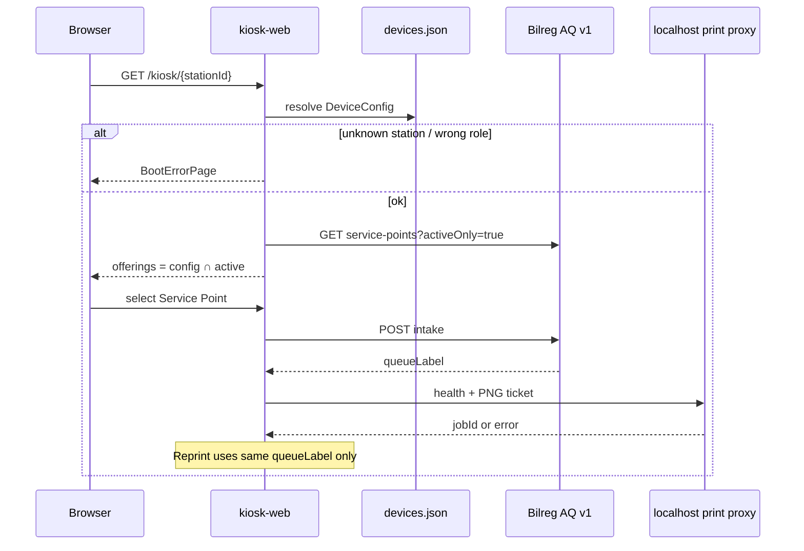

# C2 Implementation Report — Kiosk Client (monorepo path boot, intake, print)

> **Operational mirror** of `b09-bilreg-api/docs/contexts/pasien-tracker/tracker-c2-kiosk-implementation-report.md`.  
> Prefer editing the b09 canonical copy, then re-sync here for monorepo ops.

**Artifact status:** Implementation summary (closed for Phase C2)  
**Bounded context:** Patient Tracker / Admission Queue — external clients  
**Authoritative plan:** [`TRACKER-ADMISSION-QUEUE-EXTERNAL-CLIENTS-IMPLEMENTATION-PLAN.md`](../plans/TRACKER-ADMISSION-QUEUE-EXTERNAL-CLIENTS-IMPLEMENTATION-PLAN.md)  
**Architecture addendum:** [`kiosk-queue-display-web.md`](../architecture/kiosk-queue-display-web.md)  
**Code home:** `MyHospitalWeb/c013-kiosk-queue-display-web`  
**Date:** 2026-07-23

---

## 1. TL;DR

Phase **C2** delivers the Admission Queue **Kiosk** web client in a dedicated monorepo (not inside `c012`):

| Slice | Delivered |
|-------|-----------|
| **C2.0** | Monorepo scaffold, `/kiosk/{stationId}` path routing, device-config boot (`devices.json`), Service Point ∩ offerings, pending-safe `POST intake`, `version.json` + IIS `web.config` |
| **C2.1** | Local print-proxy thermal ticket (auto-print once), reprint **same** Queue Label only, uncertain network intake copy (no auto-retry) |

Officer Client remains baseline in `c012`. Display Client remains stub for **C3**.

---

## 2. Repository layout

```text
c013-kiosk-queue-display-web/
├── apps/
│   ├── kiosk-web/          # C2 — runnable
│   └── display-web/        # C3 stub
├── packages/
│   ├── shared-types/
│   ├── api-client/
│   ├── device-config/
│   ├── auth/
│   └── signalr-client/     # stub for C3
├── pnpm-workspace.yaml
└── turbo.json
```

---

## 3. Boot → intake → print flow



---

## 4. Key behaviors

| Concern | Behavior |
|---------|----------|
| Path identity | Vue Router `/:stationId` under Vite `base: '/kiosk/'` |
| Device config | `JsonDeviceConfigurationProvider` + `public/devices.json`; fails closed on missing ID |
| Auth (C2) | Env JWT `VITE_BILREG_TOKEN` via `@aq/auth` (device login deferred) |
| Intake lock | `useKioskIntake` ignores concurrent submit while `pending` |
| No client allocation | Queue Label only from intake response |
| Print once | After success, `useKioskPrint` auto-prints canvas PNG via proxy |
| Reprint | Same committed label; never re-intake |
| Uncertain intake | `ApiClientError` with `status === 0` → duplicate warning + deliberate “Coba lagi” |
| Print proxy | `http://localhost:{printerProxyPort\|\|5050}/print` — PNG body + `doctype=antrian` (c012 wire format) |

---

## 5. Exit criteria (plan §12)

### C2.0

| Criterion | Status |
|-----------|--------|
| Deep link `/kiosk/{stationId}` serves SPA (IIS / local base-path) | Met (`web.config` + Vite base) |
| Boot fails closed on unknown station | Met |
| Successful intake shows server `queueLabel` | Met |
| Double-click while pending does not dual-submit | Met (unit) |
| Shared packages build; `display-web` stub OK | Met |

### C2.1

| Criterion | Status |
|-----------|--------|
| Auto-print committed label via local proxy | Met |
| Reprint same label only | Met (unit) |
| Print failure keeps label on screen | Met (unit) |
| Uncertain network copy without auto-retry | Met (unit) |

---

## 6. Explicit non-goals (still open)

- Backend `GET /api/devices/{deviceId}/config` (JSON provider remains until that lands)
- Display snapshot / SignalR / AnnouncementVersion audio (**C3**)
- Idle `version.json` soft-reload (**C3.1**)
- R-05B `ClientRequestId` / idempotent intake
- Officer redesign in `c012`
- Print-proxy install packaging (ops)

---

## 7. Primary code touchpoints (C2.1)

| Path | Role |
|------|------|
| `apps/kiosk-web/src/lib/printProxy.ts` | Health + PNG POST to local proxy |
| `apps/kiosk-web/src/lib/queueTicket.ts` | Canvas Queue Label ticket → PNG |
| `apps/kiosk-web/src/composables/useKioskPrint.ts` | Auto-print / reprint / pending |
| `apps/kiosk-web/src/composables/useKioskIntake.ts` | Pending lock + uncertain flag |
| `apps/kiosk-web/src/views/KioskPage.vue` | Success + print UX |
| `packages/api-client/src/errors.ts` | `isUncertainIntakeError` + copy |

---

## 8. How to run

```bash
cd c013-kiosk-queue-display-web
pnpm install
cp apps/kiosk-web/.env.example apps/kiosk-web/.env.local
# set VITE_BILREG_API_BASE and VITE_BILREG_TOKEN
pnpm dev:kiosk
# open http://localhost:5173/kiosk/loket-03
```

Print requires the local thermal print proxy listening on the configured port (default **5050**).

---

## 9. Traceability

| Plan item | Artifact |
|-----------|----------|
| External clients plan §12 C2.0 / C2.1 | This report |
| Path + IIS deploy | `kiosk-queue-display-web.md` |
| AQ intake / service-points | `TRACKER-ADMISSION-QUEUE-API-V1.md` |
| Local pointer in monorepo | `c013-kiosk-queue-display-web/docs/C2-implementation-summary.md` |
