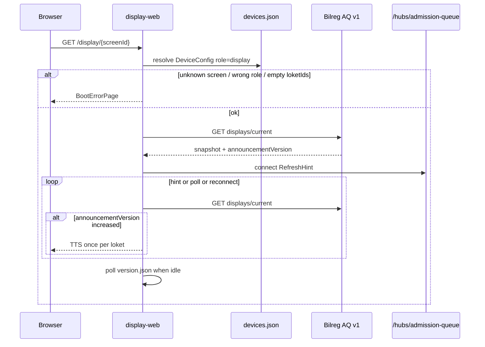

# C3 Implementation Report — Queue Display Client (snapshot-first + SignalR)

> **Operational mirror** of `b09-bilreg-api/docs/contexts/pasien-tracker/tracker-c3-queue-display-implementation-report.md`.  
> Prefer editing the b09 canonical copy, then re-sync here for monorepo ops.

**Artifact status:** Implementation summary (closed for Phase C3)  
**Bounded context:** Patient Tracker / Admission Queue — external clients  
**Authoritative plan:** [`TRACKER-ADMISSION-QUEUE-EXTERNAL-CLIENTS-IMPLEMENTATION-PLAN.md`](../plans/TRACKER-ADMISSION-QUEUE-EXTERNAL-CLIENTS-IMPLEMENTATION-PLAN.md)  
**Architecture addendum:** [`kiosk-queue-display-web.md`](../architecture/kiosk-queue-display-web.md)  
**Code home:** `MyHospitalWeb/c013-kiosk-queue-display-web`  
**Date:** 2026-07-23

---

## 1. TL;DR

Phase **C3** delivers the Admission Queue **Queue Display** web client in the same monorepo as Kiosk (C2):

| Slice | Delivered |
|-------|-----------|
| **C3.0** | `display-web` `/display/{screenId}` path boot, `devices.json` display role, `GET displays/current` snapshot render, client `loketIds` filter, poll interval |
| **C3.1** | Real `@aq/signalr-client` RefreshHint → snapshot refetch, AnnouncementVersion-gated TTS, reconnect snapshot-first, `version.json` idle soft reload |

Officer Client remains baseline in `c012`. Kiosk Client remains C2. Phase **C4** (cross-client E2E + IIS cutover + runbook) is closed — see [`tracker-c4-integration-deployment-implementation-report.md`](./tracker-c4-integration-deployment-implementation-report.md).

---

## 2. Repository layout

```text
c013-kiosk-queue-display-web/
├── apps/
│   ├── kiosk-web/          # C2 — complete
│   └── display-web/        # C3 — runnable
├── packages/
│   ├── shared-types/       # + CurrentLoketDisplayItem, poll/audio device options
│   ├── api-client/         # + getCurrentDisplays, buildAdmissionQueueHubUrl
│   ├── device-config/      # display path + fixtures
│   ├── auth/               # env JWT (unchanged)
│   └── signalr-client/     # real HubConnection + RefreshHint
├── pnpm-workspace.yaml
└── turbo.json
```

---

## 3. Boot → snapshot → hint → audio flow



---

## 4. Key behaviors

| Concern | Behavior |
|---------|----------|
| Path identity | Vue Router `/:screenId` under Vite `base: '/display/'` |
| Device config | `JsonDeviceConfigurationProvider` + `public/devices.json`; fails closed on missing ID / wrong role / empty `loketIds` |
| Auth (C3) | Env JWT `VITE_BILREG_TOKEN` via `@aq/auth` (device login deferred) |
| Snapshot authority | `GET /api/v1/admission-queue/displays/current` only; client filters by configured `loketIds` |
| Poll | TanStack Query `refetchInterval` from `pollIntervalMs` (default 15s), even when SignalR healthy |
| SignalR | Hint-only `RefreshHint { loketKey }`; `null` or matching loket → invalidate snapshot; unrelated loket ignored |
| Reconnect | Keep last frame; on reconnected → snapshot refetch first |
| Audio | Web Speech TTS; play only when snapshot `announcementVersion` increases; cold start **seeds** without playing |
| Auto-refresh | Poll `/display/version.json`; soft `location.reload()` when version differs and UI idle (not announcing) |

---

## 5. Exit criteria (plan §12)

### C3.0

| Criterion | Status |
|-----------|--------|
| Deep link `/display/{screenId}` serves SPA (IIS / local base-path) | Met (`web.config` + Vite base) |
| Boot fails closed on unknown screen / wrong role / empty loketIds | Met (unit + boot path) |
| Main UI shows Queue Label + Loket from snapshot only | Met |
| Poll refreshes snapshot on interval | Met |
| Shared packages build; kiosk unchanged | Met |

### C3.1

| Criterion | Status |
|-----------|--------|
| RefreshHint → snapshot refetch (not authoritative state) | Met |
| Audio only when snapshot `announcementVersion` increases | Met (unit) |
| First load / unknown loket seeds without audio | Met (unit) |
| Reconnect invokes snapshot-first callback | Met (package unit) |
| Idle `version.json` change triggers soft reload | Met (unit) |
| SignalR down → poll-only still correct | Met by design (poll independent of hub) |

---

## 6. Explicit non-goals (still open)

- Backend `GET /api/devices/{deviceId}/config` (JSON provider remains until that lands)
- Parallel `GET /api/displays/{screenId}/snapshot` BFF
- Cross-client E2E / IIS cutover runbook expansion — **closed in C4** ([report](./tracker-c4-integration-deployment-implementation-report.md))
- R-02 display role policy / device login
- Android TV; clip-based audio library
- Officer redesign in `c012`

---

## 7. Primary code touchpoints

| Path | Role |
|------|------|
| `apps/display-web/src/views/DisplayPage.vue` | Boot + snapshot grid + poll wiring |
| `apps/display-web/src/lib/announcementGate.ts` | AnnouncementVersion seed/live gate |
| `apps/display-web/src/lib/snapshot.ts` | loketIds filter + RefreshHint filter |
| `apps/display-web/src/composables/useDisplaySignalR.ts` | Hub connect / hint → invalidate |
| `apps/display-web/src/composables/useVersionAutoRefresh.ts` | Idle soft reload |
| `packages/api-client/src/admissionQueue.ts` | `getCurrentDisplays` + hub URL helper |
| `packages/signalr-client/src/index.ts` | `@microsoft/signalr` wrapper |
| `packages/shared-types/src/index.ts` | `CurrentLoketDisplayItem` + display device options |

---

## 8. How to run

```bash
cd c013-kiosk-queue-display-web
pnpm install
cp apps/display-web/.env.example apps/display-web/.env.local
# set VITE_BILREG_API_BASE and VITE_BILREG_TOKEN
pnpm dev:display
# open http://localhost:5174/display/lobby-poli-1
```

Mock screens in `apps/display-web/public/devices.json`: `lobby-poli-1` (L1, L2), `lobby-igd` (L3).

---

## 9. Traceability

| Plan item | Artifact |
|-----------|----------|
| External clients plan §12 C3.0 / C3.1 | This report |
| Path + IIS deploy | `kiosk-queue-display-web.md` |
| Snapshot + RefreshHint contract | `TRACKER-ADMISSION-QUEUE-API-V1.md` |
| Backend SignalR Phase 4 | `tracker-admission-queue-phase4-signalr-refresh-implementation-report.md` |
| Local pointer in monorepo | `c013-kiosk-queue-display-web/docs/C3-implementation-summary.md` |
