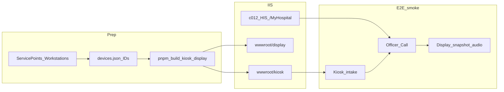

# C4 Implementation Report — Integration & Deployment

> **Operational mirror** of `b09-bilreg-api/docs/contexts/pasien-tracker/tracker-c4-integration-deployment-implementation-report.md`.  
> Prefer editing the b09 canonical copy, then re-sync here for monorepo ops.

**Artifact status:** Implementation summary (closed for Phase C4)  
**Bounded context:** Patient Tracker / Admission Queue — external clients  
**Authoritative plan:** [`TRACKER-ADMISSION-QUEUE-EXTERNAL-CLIENTS-IMPLEMENTATION-PLAN.md`](../plans/TRACKER-ADMISSION-QUEUE-EXTERNAL-CLIENTS-IMPLEMENTATION-PLAN.md)  
**Architecture addendum:** [`kiosk-queue-display-web.md`](../architecture/kiosk-queue-display-web.md)  
**Ops procedures:** [`TRACKER-ADMISSION-QUEUE-RUNBOOK.md`](../ops/TRACKER-ADMISSION-QUEUE-RUNBOOK.md) §§8–11  
**IIS cutover gates:** [`TRACKER-ADMISSION-QUEUE-IIS-CLIENT-CUTOVER-CHECKLIST.md`](../ops/TRACKER-ADMISSION-QUEUE-IIS-CLIENT-CUTOVER-CHECKLIST.md)  
**Code homes:** `c012_myhospital_web` (Officer), `c013-kiosk-queue-display-web` (Kiosk + Display)  
**Date:** 2026-07-23

---

## 1. TL;DR

Phase **C4** closes Part 2 (external clients) as **ops closure** — not new client features:

| Deliverable | Location |
|-------------|----------|
| Cross-client E2E smoke (plan §9.4) | Runbook §11 |
| IIS packaging + cutover gates | IIS client cutover checklist + runbook §§9–10 |
| Client deploy / config sections | Runbook §§8–10 |
| Rollout linkage | Rollout checklist **R6** |

Officer (C0/C1), Kiosk (C2), and Display (C3) remain as shipped. C4 documents how to package, cut over, and prove the three clients together against Bilreg Admission Queue v1.

---

## 2. Client constellation (as-of C4)

| Client | Repo | Deploy path | Status before C4 |
|--------|------|-------------|------------------|
| Officer | `c012_myhospital_web` | IIS `/MyHospital/` | ✅ C0/C1 baseline |
| Kiosk | `c013` `apps/kiosk-web` | IIS `/kiosk/{stationId}` | ✅ C2 |
| Display | `c013` `apps/display-web` | IIS `/display/{screenId}` | ✅ C3 |

---

## 3. Exit criteria (plan §9.4 / §10 / §12)

| Criterion | Status | Evidence |
|-----------|--------|----------|
| Kiosk intake → Officer worklist shows Queue Label | Documented | Runbook §11 step 1 |
| Officer Call → Display snapshot + `AnnouncementVersion` audio | Documented | Runbook §11 step 2 |
| Start Service → Display updates via hint/poll | Documented | Runbook §11 step 3 |
| Established outcome → entry leaves worklist | Documented | Runbook §11 step 4 |
| SignalR down → Display recovers via poll | Documented | Runbook §11 step 5 |
| Second Call same Loket → 409 → Officer reload | Documented | Runbook §11 step 6 |
| New `version.json` → idle soft-reload | Documented | Runbook §11 step 7 |
| IIS SPA deep-link `/kiosk/{id}` and `/display/{id}` | Documented | Runbook §10 + IIS checklist |
| Dist includes `index.html`, `version.json`, `web.config`, `devices.json` | Documented | IIS checklist build gate |
| Device config row per shortcut ID | Documented | Runbook §9 + IIS checklist |
| Print proxy note on kiosk PC | Documented | Runbook §9 |
| Rollout checklist links client cutover | Met | R6 gate |

C4 delivers **executable ops procedures**. Live sign-off on an integration host is performed by ops using the checklists (not claimed as executed by this report).

---

## 4. Artifact map

| Artifact | Role |
|----------|------|
| This report | C4 closure evidence |
| [`TRACKER-ADMISSION-QUEUE-RUNBOOK.md`](../ops/TRACKER-ADMISSION-QUEUE-RUNBOOK.md) §§8–11 | Officer / Kiosk / Display / IIS / E2E procedures |
| [`TRACKER-ADMISSION-QUEUE-IIS-CLIENT-CUTOVER-CHECKLIST.md`](../ops/TRACKER-ADMISSION-QUEUE-IIS-CLIENT-CUTOVER-CHECKLIST.md) | Go / No-Go gates for client IIS cutover |
| [`TRACKER-ADMISSION-QUEUE-ROLLOUT-CHECKLIST.md`](../ops/TRACKER-ADMISSION-QUEUE-ROLLOUT-CHECKLIST.md) R6 | Backend Phase 5 checklist ↔ client cutover |
| [`kiosk-queue-display-web.md`](../architecture/kiosk-queue-display-web.md) | Path-based IIS + monorepo ADR |
| `c013-kiosk-queue-display-web/docs/C4-implementation-summary.md` | Local monorepo pointer |

---

## 5. Explicit non-goals (still open)

- Backend `GET /api/devices/{deviceId}/config` (JSON `devices.json` remains until that lands)
- R-02 device login / Officer–Kiosk–Display role policies
- R-05B `ClientRequestId` / idempotent kiosk intake
- Automated Playwright (or similar) cross-client suite
- Android TV display track
- Production SignalR scale-out / multi-node backplane
- Officer redesign in `c012`
- Print-proxy install packaging (ops install remains external)

---

## 6. How ops uses C4

1. Backend integration green: runbook §§1–5 + rollout R1–R5.  
2. Client cutover: [IIS client cutover checklist](../ops/TRACKER-ADMISSION-QUEUE-IIS-CLIENT-CUTOVER-CHECKLIST.md).  
3. Prove constellation: runbook §11 cross-client E2E.  
4. Record R6 on [rollout checklist](../ops/TRACKER-ADMISSION-QUEUE-ROLLOUT-CHECKLIST.md).

---

## 7. Traceability

| Plan item | Artifact |
|-----------|----------|
| External clients plan §9.4 Cross-client E2E | Runbook §11 |
| External clients plan §10 Deployment | Runbook §§8–10 + IIS checklist |
| External clients plan §12 C4 | This report |
| Path + IIS deploy ADR | `kiosk-queue-display-web.md` |
| C2 / C3 code closure | `tracker-c2-kiosk-implementation-report.md`, `tracker-c3-queue-display-implementation-report.md` |
| Local pointer in monorepo | `c013-kiosk-queue-display-web/docs/C4-implementation-summary.md` |
