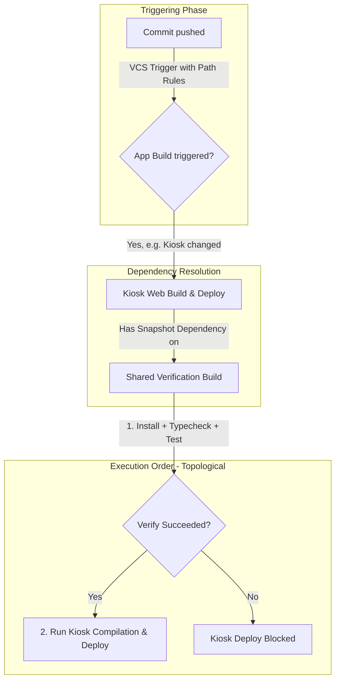

# TeamCity CI/CD Strategy for Kiosk & Queue Display Monorepo

This document outlines a robust, enterprise-grade CI/CD strategy using **JetBrains TeamCity** to build, test, and deploy the frontend monorepo (`c013-kiosk-queue-display-web`) consisting of `kiosk-web`, `display-web`, and `config-web` to an on-premise IIS hosting environment.

---

## 1. Pipeline Architecture & Build Chain

To achieve efficient builds and prevent redundant deployments, the monorepo utilizes a **Build Chain** in TeamCity with path-based VCS triggering. 

In TeamCity, rather than triggering the verification build and hoping it propagates forward, we configure **Snapshot Dependencies** on the final deployment builds. This creates a dependency-driven execution order.



### 1.1 Build Configurations Setup

We define four main configurations in TeamCity:
1. **Shared Verification Build (Base)**: Installs dependencies, then runs `pnpm typecheck` and `pnpm test` across the entire repository. This acts as the gatekeeper. Note: the first run on a cold cache will be slower because Turborepo must compile all shared packages (`@aq/shared-types`, `@aq/api-client`, etc.) before running typecheck/test — subsequent runs benefit from Turborepo caching.
2. **Kiosk Web Build & Deploy**: Compiles and deploys `apps/kiosk-web`.
3. **Display Web Build & Deploy**: Compiles and deploys `apps/display-web`.
4. **Config Web Build & Deploy**: Compiles and deploys `apps/config-web`.

#### Package Name → IIS Deployment Mapping

| Workspace package | IIS folder | Vite `base` | Deploy `$AppName` param |
|---|---|---|---|
| `kiosk-web` | `wwwroot/kiosk` | `/kiosk/` | `kiosk` |
| `display-web` | `wwwroot/display` | `/display/` | `display` |
| `config-web` | `wwwroot/queue-config` | `/queue-config/` | `queue-config` |

#### Shared Verification Build Steps

The Shared Verification Build runs in its **own checkout directory** — it does NOT share `node_modules` with the per-app deployment builds. Therefore, it must perform its own install:

1. **Step 1**: PNPM Setup (Method A or B — see Section 5)
2. **Step 2**: `pnpm install --frozen-lockfile`
3. **Step 3**: `pnpm turbo run typecheck test`

> [!IMPORTANT]
> The `lint` scripts across all apps and packages are currently **noop** (empty string). Do not include `lint` in the verification command until ESLint is implemented. Running `pnpm turbo run lint` will succeed silently without checking anything, giving false confidence.

### 1.2 Execution Order & Snapshot Dependencies

To establish the correct order where deployment only occurs after verification succeeds:

1. **Snapshot Dependency Configuration**:
   - For **Kiosk Web Build & Deploy**, configure a **Snapshot Dependency** pointing to **Shared Verification Build**.
   - Do the same for **Display Web Build & Deploy** and **Config Web Build & Deploy**.
   - Check option: **"Do not run build if dependency failed"** and **"Run build on the same revision"**.

2. **Triggering Behavior**:
   - The **VCS Trigger** is placed directly on the **individual deployment builds** (using the path triggers defined in Section 2).
   - When a commit is pushed that modifies `apps/kiosk-web/**`, the VCS trigger on **Kiosk Web Build & Deploy** is activated.
   - TeamCity analyzes the build chain, notices the snapshot dependency, and automatically schedules the **Shared Verification Build** first, matching the exact git commit revision.
   - **Shared Verification Build** executes first:
     - **If it succeeds**: TeamCity immediately executes the triggered **Kiosk Web Build & Deploy**.
     - **If it fails**: The build chain is broken. **Kiosk Web Build & Deploy** is aborted/marked as "Failed Dependency", preventing any deployment from occurring.

This ensures you never deploy code that fails global tests, while still avoiding building apps that haven't changed.

---

## 2. VCS Trigger Rules (Path-Based Filters)

We configure VCS triggers on each specific build configuration so that changes to individual applications don't trigger builds for unaffected applications, while changes to common dependencies (in `packages/**`, root configurations, and locks) trigger builds for all dependent apps.

### 2.1 Step-by-Step UI Configuration in TeamCity

Follow these exact steps in the TeamCity Administration UI to configure path-based triggering:

1. **Navigate to Build Configuration Settings**:
   - Open your TeamCity dashboard.
   - Select the target build configuration (e.g., **Kiosk Web Build & Deploy**).
   - Click **Edit Configuration Settings** in the upper right corner.

2. **Access Triggers Panel**:
   - In the left sidebar under the *Build Configuration Settings* section, click on **Triggers** (Item 5/6 depending on custom templates).

3. **Add or Edit the VCS Trigger**:
   - If a VCS Trigger already exists, click **Edit** next to it.
   - Otherwise, click **Add new trigger** and choose **VCS Trigger** from the dropdown menu.

4. **Define Trigger Rules**:
   - In the trigger configuration dialog, locate the text area labeled **Trigger rules**.
   - Input your path-based wildcards. Each rule must reside on a separate line.
   - *Example Kiosk Web Rules:*
     ```text
     +:apps/kiosk-web/**
     +:packages/**
     +:package.json
     +:pnpm-lock.yaml
     +:turbo.json
     +:tsconfig.base.json
     +:.prettierrc.json
     +:.prettierignore
     ```
   
5. **Configure Trigger Options**:
   - **Trigger build on each check-in**: Check this box if you want a separate build for every commit rather than grouping them.
   - **Include check-ins by the same developer**: Normally checked (`true`) to trigger builds for your own commits.
   - Click **Save** to apply the triggers.

---

### 2.2 Trigger Rule Syntax Explained

TeamCity parses trigger rules using a simple inclusion/exclusion syntax evaluated from top to bottom:

* **`+:` (Inclusion Rule)**: Triggers a build if a changed file matches the path.
* **`-:` (Exclusion Rule)**: Prevents triggering a build even if a file matches subsequent inclusion rules.
* **`**` (Recursive Wildcard)**: Matches any file or directory depth (e.g., `packages/**` matches `packages/api-client/src/index.ts`).
* **`*` (Single Directory Wildcard)**: Matches files in the current folder only, without traversing subfolders.

#### Monorepo Core Mappings
* **`+:apps/kiosk-web/**`**: Matches any modification in the Kiosk app folder itself.
* **`+:packages/**`**: Matches any change inside shared package files. Because `kiosk-web`, `display-web`, and `config-web` import from packages such as `@aq/shared-types` or `@aq/api-client`, any changes here must automatically trigger builds for all apps.
* **`+:package.json` & `+:pnpm-lock.yaml`**: Triggers a build when project-wide npm dependencies are updated.
* **`+:turbo.json`**: Triggers a build if the Turborepo configuration pipeline or caching rules are updated.
* **`+:tsconfig.base.json`**: Triggers a build if base TypeScript rules are altered.
* **`+:.prettierrc.json` & `+:.prettierignore`**: Triggers a build if formatting configuration changes.

---

### 2.3 Kotlin DSL Implementation

If your TeamCity project is configured using **Configuration as Code (Kotlin DSL)**, you can declare the triggers and snapshot dependencies directly in your build definition file (e.g., `settings.kts`):

#### Shared Verification Build DSL
```kotlin
object SharedVerificationBuild : BuildType({
    id("SharedVerificationBuild")
    name = "Shared Verification Build"

    // Build steps: PNPM setup → install → typecheck + test
    steps {
        powerShell {
            name = "PNPM Setup"
            scriptMode = script {
                content = """
                    npm config set prefix "${'$'}env:APPDATA\npm"
                    npm install -g pnpm@10.14.0
                    Write-Output "##teamcity[setParameter name='env.PATH' value='${'$'}env:APPDATA\npm;%env.PATH%']"
                """.trimIndent()
            }
        }
        script {
            name = "Install Dependencies"
            scriptContent = "pnpm install --frozen-lockfile"
        }
        script {
            name = "Typecheck & Test"
            scriptContent = "pnpm turbo run typecheck test"
        }
    }
})
```

#### Kiosk Web Build & Deploy DSL
```kotlin
object KioskWebBuild : BuildType({
    id("KioskWebBuild")
    name = "Kiosk Web Build & Deploy"
    
    // Snapshot dependency: verification must pass first
    dependencies {
        snapshot(SharedVerificationBuild) {
            onDependencyFailure = FailureAction.FAIL_TO_START
            reuseBuilds = ReuseBuilds.SUCCESSFUL
        }
    }

    triggers {
        vcs {
            watchChangesInDependency = true
            triggerRules = """
                +:apps/kiosk-web/**
                +:packages/**
                +:package.json
                +:pnpm-lock.yaml
                +:turbo.json
                +:tsconfig.base.json
                +:.prettierrc.json
                +:.prettierignore
            """.trimIndent()
        }
    }
})
```

#### Display Web Build & Deploy DSL
```kotlin
object DisplayWebBuild : BuildType({
    id("DisplayWebBuild")
    name = "Display Web Build & Deploy"

    dependencies {
        snapshot(SharedVerificationBuild) {
            onDependencyFailure = FailureAction.FAIL_TO_START
            reuseBuilds = ReuseBuilds.SUCCESSFUL
        }
    }

    triggers {
        vcs {
            triggerRules = """
                +:apps/display-web/**
                +:packages/**
                +:package.json
                +:pnpm-lock.yaml
                +:turbo.json
                +:tsconfig.base.json
                +:.prettierrc.json
                +:.prettierignore
            """.trimIndent()
        }
    }
})
```

#### Config Web Build & Deploy DSL
```kotlin
object ConfigWebBuild : BuildType({
    id("ConfigWebBuild")
    name = "Config Web Build & Deploy"

    dependencies {
        snapshot(SharedVerificationBuild) {
            onDependencyFailure = FailureAction.FAIL_TO_START
            reuseBuilds = ReuseBuilds.SUCCESSFUL
        }
    }

    triggers {
        vcs {
            triggerRules = """
                +:apps/config-web/**
                +:packages/**
                +:package.json
                +:pnpm-lock.yaml
                +:turbo.json
                +:tsconfig.base.json
                +:.prettierrc.json
                +:.prettierignore
            """.trimIndent()
        }
    }
})
```

---

## 3. Caching Strategy (Turborepo + TeamCity)

To speed up builds and fully leverage **Turborepo**'s build-caching mechanism:

1. **Turborepo Cache**: Turborepo caches task outputs in `.turbo/` by default. Preserve this directory across builds.
2. **pnpm Store**: pnpm's content-addressable store lives at `%LOCALAPPDATA%\pnpm\store` on Windows. To make it cacheable within the workspace, colocate it:
   ```bash
   pnpm config set store-dir .pnpm-store
   ```
   Then cache `.pnpm-store/` alongside `.turbo/`.
3. **TeamCity Build Cache**: Configure the TeamCity Build Feature **Build Cache** to preserve:
   - `.turbo/` — Turborepo task output cache
   - `.pnpm-store/` — pnpm content-addressable store (if colocated per above)
   
This reduces dependency resolution and incremental build times from minutes to seconds.

---

## 4. Build Configuration Parameters (Vite Env Injection)

Since Vite compiles environment variables directly into the client bundle at build-time, we must configure TeamCity parameters to inject the correct values depending on the target environment (Integration, Staging, Production).

Vite reads environment variables from the OS process environment (not TeamCity's internal `%param%` syntax). Therefore, all `VITE_*` parameters must be declared as **Environment Variables** (`env.` prefix) in TeamCity.

| Parameter Name | Description | TeamCity Type | Target Value / Variable |
|---|---|---|---|
| `env.VITE_BILREG_API_BASE` | Base URL of the Bilreg API | Environment variable (`env.`) | `http://<api-ip-or-host>/api` |

> [!NOTE]
> `VITE_BILREG_API_BASE` is the **only** build-time environment variable required. `VITE_BILREG_TOKEN` was removed in the recent refactor (kiosk and display endpoints are public/unauthenticated, while `config-web` uses interactive session auth). No static JWT tokens are needed at build time.

---

## 5. Build Steps Execution Flow

Each application build configuration follows this step-by-step runner structure in TeamCity:

### Step 1: Environment Provisioning & permission-safe PNPM Setup (PowerShell / Command Line Runner)
Since Node is installed globally in a write-protected directory (e.g. `C:\Program Files\nodejs\`), running `corepack enable` fails with `EPERM` (operation not permitted) when trying to write to the global node folder. 

To bypass this without administrator rights on the TeamCity agent, configure **one** of the following methods:

---

#### Method A: User-Space Global Installation (Recommended)
This method installs `pnpm` globally inside the user's AppData profile directory and uses a TeamCity **Service Message** to dynamically append the folder to the path for all subsequent build steps.

##### UI Configuration Step-by-Step:
1. In the TeamCity administration panel for your build configuration, click on **Build Steps** in the left sidebar.
2. Click **Add build step**.
3. For **Runner type**, select **PowerShell**.
4. Configure the following fields:
   * **Step name**: `PNPM Setup (User-Space)`
   * **Execute step**: `If all previous steps finished successfully`
   * **PowerShell version**: `default`
   * **Platform**: `Auto`
   * **Edition**: `Desktop` (or `Core` depending on your agent)
   * **Script**: Select **Source code**
5. Paste the following script into the **Script source** box:
   ```powershell
   # 1. Set npm global prefix to user-writable AppData folder
   npm config set prefix "$env:APPDATA\npm"

   # 2. Install pnpm globally inside user-space
   npm install -g pnpm@10.14.0

   # 3. Dynamic PATH propagation in TeamCity using Service Messages.
   # This line tells TeamCity to update its environment parameters so that
   # all subsequent build steps can call the 'pnpm' command directly.
   Write-Output "##teamcity[setParameter name='env.PATH' value='$env:APPDATA\npm;%env.PATH%']"
   ```
6. Click **Save**.

---

#### Method B: Zero-Config Local Package Installation (Alternative)
This method installs `pnpm` inside the workspace's local `node_modules` folder. It is fast and does not modify system paths, but requires invoking pnpm relative to the project directory.

##### UI Configuration Step-by-Step:
1. In the TeamCity administration panel for your build configuration, click on **Build Steps** in the left sidebar.
2. Click **Add build step**.
3. For **Runner type**, select **Command Line**.
4. Configure the following fields:
   * **Step name**: `Local PNPM Setup`
   * **Run**: Select **Custom script**
5. Paste the following script into the **Custom script** box:
   ```bash
   # Install pnpm locally inside node_modules without altering package.json
   npm install pnpm@10.14.0 --no-save
   ```
6. Click **Save**.

*Note: If you use Method B, you must call pnpm using `node_modules\.bin\pnpm` in all subsequent steps.*

---

### Step 2: Install Dependencies (Command Line Runner)
Run the install command. Use the matching syntax based on the method selected in Step 1:

**If using Method A (User-Space Global):**
```bash
pnpm install --frozen-lockfile
```

**If using Method B (Local package):**
```bash
node_modules\.bin\pnpm install --frozen-lockfile
```

### Step 3: Production Compilation (Command Line Runner)
Build the specific app and all its upstream workspace dependencies. Turborepo's `build` task has `dependsOn: ["^build"]`, so shared packages (`@aq/shared-types`, `@aq/api-client`, etc.) are compiled first automatically.

*(If using Method B in Step 1, replace `pnpm` with `node_modules\.bin\pnpm`)*:
```bash
pnpm turbo run build --filter=<app-name>
```

> [!NOTE]
> **`version.json` is generated automatically.** Each app includes a custom Vite plugin (`aq-version-json`) that writes `{ "version": "0.1.0-<base36-timestamp>", "builtAt": "<ISO date>" }` into `dist/version.json` during the `closeBundle()` hook. Do NOT overwrite this file after the build — the `display-web` auto-refresh composable (`useVersionAutoRefresh.ts`) expects these exact field names.

### Step 4: Artifact Packaging
Define artifact rules in the build configuration to package the output as a ZIP file:
```text
apps/<app-name>/dist/** => <app-name>-build-%build.number%.zip
```

Use the mapping table from Section 1.1 to determine `<app-name>` for each configuration.

---

## 6. On-Premise IIS Deployment Strategy

Since the target environment is a local on-premise IIS instance hosting all apps under a single web site (`/kiosk`, `/display`, and `/queue-config` paths), the deployment configuration uses a TeamCity agent located on the target IIS server or an SSH/WinRM remote script runner to perform cutover operations.

### PowerShell Cutover Script (Run on Target IIS Agent)
This script performs a safe cutover by backing up the existing directory before copying the build assets over.

```powershell
Param(
    [string]$AppRoot = "C:\inetpub\wwwroot",
    [string]$AppName = "kiosk", # or "display", "queue-config"
    [string]$SourceZip = "%teamcity.build.checkoutDir%\<app-name>-build-%build.number%.zip"
)

$TargetDir = Join-Path $AppRoot $AppName
$BackupDir = Join-Path $AppRoot "backups\$AppName"
$Timestamp = Get-Date -Format "yyyyMMdd_HHmmss"
$BackupZip = Join-Path $BackupDir "$AppName`_$Timestamp.zip"

Write-Host "Starting deployment for $AppName to $TargetDir..."

# 1. Ensure Target & Backup Directories Exist
if (!(Test-Path $BackupDir)) {
    New-Item -ItemType Directory -Path $BackupDir -Force | Out-Null
}
if (!(Test-Path $TargetDir)) {
    New-Item -ItemType Directory -Path $TargetDir -Force | Out-Null
}

# 2. Backup Current Assets (if directory is not empty)
if ((Get-ChildItem $TargetDir).Count -gt 0) {
    Write-Host "Backing up existing deployment to $BackupZip..."
    Compress-Archive -Path "$TargetDir\*" -DestinationPath $BackupZip -Force
}

# 3. Clean target directory (except web.config to avoid overwriting custom IIS rules if modified)
Write-Host "Clearing old static assets..."
Get-ChildItem -Path $TargetDir -Recurse | Where-Object { $_.Name -ne "web.config" } | Remove-Item -Recurse -Force

# 4. Extract New Version
Write-Host "Extracting build artifacts to $TargetDir..."
Expand-Archive -Path $SourceZip -DestinationPath $TargetDir -Force

# 5. Verify web.config is present (if missing in build, restore base)
$WebConfigPath = Join-Path $TargetDir "web.config"
if (!(Test-Path $WebConfigPath)) {
    Write-Warning "web.config not found in zip! Creating default fallback..."
    $DefaultConfig = @"
<configuration>
  <system.webServer>
    <rewrite>
      <rules>
        <rule name="SPA_Fallback" stopProcessing="true">
          <match url=".*" />
          <conditions logicalGrouping="MatchAll">
            <add input="{REQUEST_FILENAME}" matchType="IsFile" negate="true" />
            <add input="{REQUEST_FILENAME}" matchType="IsDirectory" negate="true" />
          </conditions>
          <action type="Rewrite" url="/$AppName/index.html" />
        </rule>
      </rules>
    </rewrite>
    <staticContent>
      <remove fileExtension=".json" />
      <mimeMap fileExtension=".json" mimeType="application/json" />
    </staticContent>
  </system.webServer>
</configuration>
"@
    $DefaultConfig | Out-File -FilePath $WebConfigPath -Encoding UTF8
}

# 6. Set Cache Control rules (no-cache for index.html / version.json)
# Note: Typically handled in root IIS static content rules or via custom web.config configuration.

Write-Host "Deployment completed successfully!"
```

---

## 7. Version Soft-Reload (Auto-Recovery)

Each app includes a custom Vite plugin (`aq-version-json`) that generates `dist/version.json` at build time with the following structure:

```json
{ "version": "0.1.0-k5abc123", "builtAt": "2026-07-30T09:00:00.000Z" }
```

The `display-web` app includes a `useVersionAutoRefresh.ts` composable that:
1. Periodically polls `/${BASE_URL}version.json` (e.g. `/display/version.json`).
2. Compares the `version` field against the value embedded at initial load.
3. If a difference is detected and the device is currently idle (e.g. no active ticket generation or voice call), performs a soft-reload (`window.location.reload(true)`).

When TeamCity deploys a new build, the `version.json` file is automatically updated (it contains a base36 timestamp that changes with every build). Physical kiosk and display screens will pick up the change on the next poll cycle without manual intervention.

> [!IMPORTANT]
> Do NOT add a manual `version.json` generation step in TeamCity. The Vite plugin handles this. Overwriting `dist/version.json` after the build will break the auto-refresh mechanism because `useVersionAutoRefresh` expects the `version` and `builtAt` fields produced by the plugin.

---

## 8. Rollback Procedure

If a deployed build displays regression or issues during the E2E verification steps:
1. Identify the target build in TeamCity.
2. Click **Re-deploy** or run the deployment step pointing to the previous successful artifact zip (`<app-name>-build-<previous-successful-build-number>.zip`).
3. Alternatively, run a TeamCity-managed quick restore script that extracts the backup zip file generated in step 2 of the PowerShell Cutover Script.

---

## 9. Common Troubleshooting & Pitfalls

### 9.1 Error: `'turbo' is not recognized as an internal or external command`
This error occurs alongside the warning: `WARN Local package.json exists, but node_modules missing, did you mean to install?`.

#### Root Causes:
1. **Missing `pnpm install` Step**:
   You have configured the validation or build step (e.g. `validate (PowerShell)`) but forgot to define and run the `pnpm install --frozen-lockfile` (or `node_modules\.bin\pnpm install`) step *before* running scripts in that Build Configuration.
2. **Configuration Workspace Isolation**:
   If the `Validate` process is a separate Build Configuration (`C013KioskQueueDisplayWeb_Validate`), it executes in a **separate check-out directory** from your compilation configurations. Workspace files (including `node_modules`) do not persist across different configurations unless shared via TeamCity Artifact Dependencies. Therefore, every individual Build Configuration requiring compilation, linting, or tests must perform its own `pnpm install` step.
3. **Attempting to Execute `turbo` Directly**:
   If you try to call the `turbo` command directly in PowerShell/Command Line (e.g., `turbo run lint`), Windows looks for it globally. Because `turbo` is only declared as a local devDependency in the monorepo's `package.json`, you must execute it via `pnpm` (which automatically places local node_modules binaries into the execution context PATH).

#### How to Fix:
Make sure your target build configuration (`C013KioskQueueDisplayWeb_Validate`) script contains these exact lines in PowerShell:

```powershell
# 1. Setup pnpm in user-space
npm config set prefix "$env:APPDATA\npm"
$env:PATH = "$env:APPDATA\npm;$env:PATH"
npm install -g pnpm@10.14.0

# 2. Add local node_modules\.bin to PATH so Windows finds 'turbo.cmd'
$env:PATH = "$PWD\node_modules\.bin;$env:PATH"

# 3. Install workspace dependencies
pnpm install --frozen-lockfile

# 4. Run typecheck and tests (skip lint since lint scripts are noop)
pnpm turbo run typecheck test
```

> [!WARNING]
> Do not include `lint` in the verification command. All `lint` scripts in this monorepo are currently noop (empty string). Running `pnpm turbo run lint` will fail or succeed silently without checking anything.
